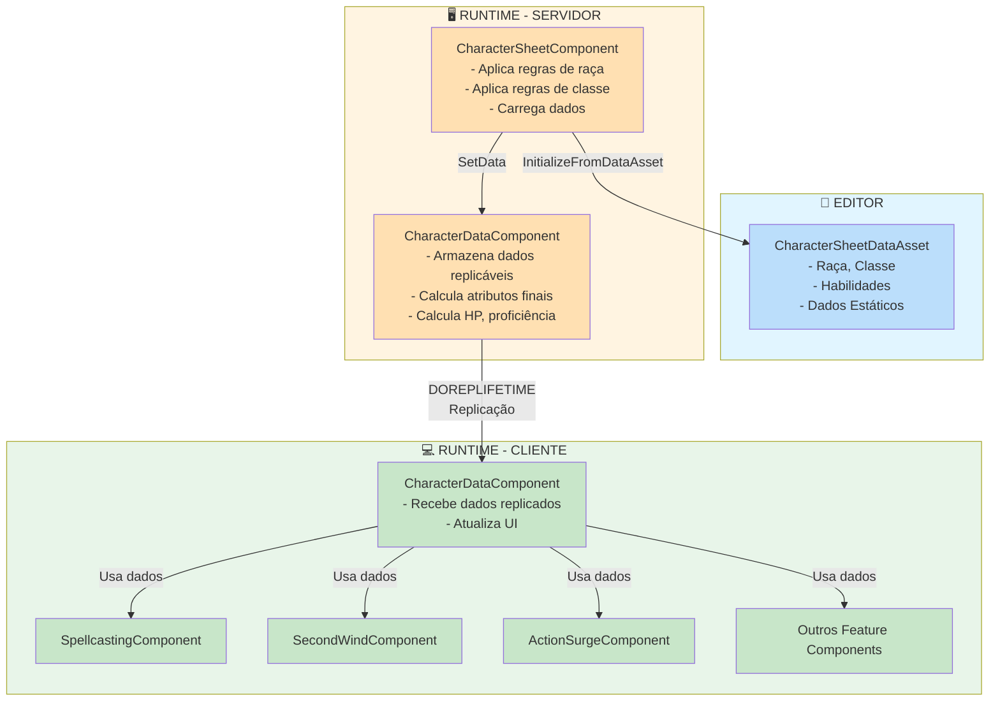
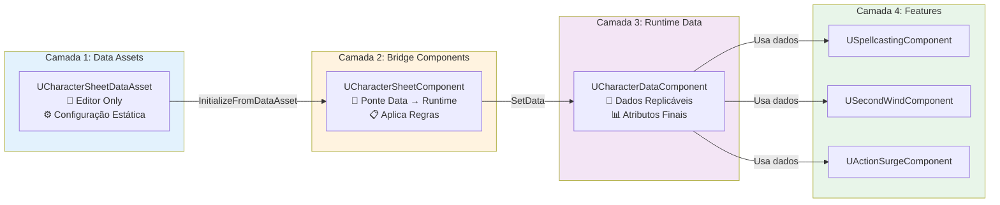
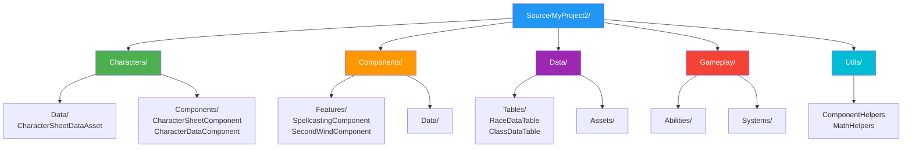

# Arquitetura do Projeto - MyProject2

## Visão Geral

Este documento descreve a arquitetura do projeto, baseada em princípios de design que garantem código limpo, manutenível, escalável e preparado para multiplayer.

## Princípios de Design

### 1. Data-Driven

**Conceito:** Todas as regras vêm de Data Tables ou Data Assets, não de código hardcoded.

**Benefícios:**

- ✅ Designers podem modificar regras sem programadores
- ✅ Fácil adicionar novo conteúdo
- ✅ Suporte a localização
- ✅ Validação automática

**Implementação:**

- Use `UDataTable` para dados tabulares (raças, classes, itens)
- Use `UDataAsset` para configurações complexas (fichas de personagem)
- Valide dados no editor com `PostEditChangeProperty()`
- Use `FTableRowBase` para estruturas de dados

**Exemplo:**

```cpp
// ✅ CORRETO - Data-Driven
UPROPERTY(EditDefaultsOnly, Category = "Data")
UDataTable* RaceDataTable;

// ❌ ERRADO - Hardcoded
const float DwarfConstitutionBonus = 2.0f;
```

### 2. Modularidade

**Conceito:** Código organizado por domínio, cada parte com responsabilidade única e clara.

**Benefícios:**

- ✅ Fácil manutenção
- ✅ Fácil expansão
- ✅ Código limpo e organizado
- ✅ Reutilização de componentes

**Estrutura de Diretórios:**

```
Source/MyProject2/
├── Characters/          # Personagens e raças
│   ├── Data/           # Data Assets de personagens
│   └── Components/      # Componentes de personagem
├── Components/          # Componentes reutilizáveis
│   ├── Data/           # Componentes de dados
│   ├── Features/        # Componentes de features
│   └── UI/             # Componentes de UI
├── Data/               # Data Assets e Data Tables
│   ├── Tables/         # Data Tables
│   └── Assets/         # Data Assets
├── Gameplay/           # Mecânicas de jogo
│   ├── Abilities/      # Habilidades
│   └── Systems/        # Sistemas de jogo
└── Utils/              # Utilitários
```

### 3. Editor-Friendly

**Conceito:** Sistema funciona perfeitamente no editor, permitindo configuração rápida sem rodar o jogo.

**Benefícios:**

- ✅ Designers podem trabalhar sem rodar o jogo
- ✅ Testes rápidos
- ✅ Iteração rápida
- ✅ Validação em tempo real

**Implementação:**

- Use `WITH_EDITOR` para código específico do editor
- Valide dados em `PostEditChangeProperty()`
- Use `UPROPERTY(EditAnywhere)` para propriedades editáveis
- Forneça feedback visual no editor quando possível

**Exemplo:**

```cpp
#if WITH_EDITOR
void UCharacterSheetDataAsset::PostEditChangeProperty(FPropertyChangedEvent& PropertyChangedEvent)
{
    Super::PostEditChangeProperty(PropertyChangedEvent);
    ValidateData();
}
#endif
```

### 4. Preparação para Multiplayer

**Conceito:** Sistema preparado para multiplayer desde o início, não precisa refatorar depois.

**Benefícios:**

- ✅ Não precisa refatorar depois
- ✅ Lógica autoritária correta desde o início
- ✅ Sincronização automática
- ✅ Escalável para servidor dedicado

**Implementação:**

- **SEMPRE** use `DOREPLIFETIME` para propriedades replicáveis
- **SEMPRE** valide RPCs com `WithValidation`
- **SEMPRE** execute lógica autoritária no servidor
- **SEMPRE** use `GetLocalRole()` para verificar autoridade
- **NUNCA** confie em dados do cliente sem validação

**Exemplo:**

```cpp
// ✅ CORRETO - Replicação
void AMyCharacter::GetLifetimeReplicatedProps(TArray<FLifetimeProperty>& OutLifetimeProps) const
{
    Super::GetLifetimeReplicatedProps(OutLifetimeProps);
    DOREPLIFETIME(AMyCharacter, CharacterData);
}

// ✅ CORRETO - RPC com validação
UFUNCTION(Server, Reliable, WithValidation)
void ServerTakeDamage(float DamageAmount);

bool ServerTakeDamage_Validate(float DamageAmount)
{
    return DamageAmount >= 0.0f && DamageAmount <= 1000.0f;
}

void ServerTakeDamage_Implementation(float DamageAmount)
{
    // Lógica autoritária apenas no servidor
    if (GetLocalRole() == ROLE_Authority)
    {
        Health -= DamageAmount;
    }
}
```

### 5. Separação de Responsabilidades (Component-Based Architecture)

**Conceito:** Cada camada tem responsabilidade única e bem definida.

**Benefícios:**

- ✅ Separação clara entre configuração (Editor) e execução (Runtime)
- ✅ Fácil testar cada camada independentemente
- ✅ Preparado para GAS (dados em Component, lógica em Abilities)
- ✅ Replicação eficiente (apenas dados necessários)

## Arquitetura em Camadas

> **💡 Dica:** Veja o diagrama visual abaixo para entender melhor a arquitetura em camadas.

### Camada 1: Data Assets (Editor/Configuração)

**Responsabilidade:** Armazenar configuração estática, não contém lógica.

**Características:**

- Herda de `UDataAsset`
- `UPROPERTY(EditDefaultsOnly)` - editável apenas em defaults
- Não é replicável (não precisa em runtime)
- Funciona apenas no editor para designers
- Exemplo: `UCharacterSheetDataAsset`

**Padrão de Implementação:**

```cpp
UCLASS(BlueprintType)
class MYPROJECT2_API UCharacterSheetDataAsset : public UDataAsset
{
    GENERATED_BODY()

public:
    UPROPERTY(EditDefaultsOnly, Category = "Character")
    ERace Race;

    UPROPERTY(EditDefaultsOnly, Category = "Character")
    EClass Class;

    UPROPERTY(EditDefaultsOnly, Category = "Character")
    TArray<FAbilityScore> BaseAbilityScores;

#if WITH_EDITOR
    virtual void PostEditChangeProperty(FPropertyChangedEvent& PropertyChangedEvent) override;
#endif
};
```

### Camada 2: Bridge Components (Aplicação de Regras)

**Responsabilidade:** Fazer ponte entre Data Asset e Runtime Component, aplicar regras de raça e classe.

**Características:**

- Herda de `UActorComponent`
- Executa apenas no servidor/local (não replicável)
- Aplica regras de raça e classe (`ApplyRaceBonuses()`, `ApplyClassFeatures()`)
- Carrega dados do Data Asset para Runtime Component
- Exemplo: `UCharacterSheetComponent`

**Padrão de Implementação:**

```cpp
UCLASS(ClassGroup=(Custom), meta=(BlueprintSpawnableComponent))
class MYPROJECT2_API UCharacterSheetComponent : public UActorComponent
{
    GENERATED_BODY()

public:
    UFUNCTION(BlueprintCallable, Category = "Character")
    void InitializeFromDataAsset(UCharacterSheetDataAsset* DataAsset);

    UFUNCTION(BlueprintCallable, Category = "Character")
    void ApplyRaceBonuses();

    UFUNCTION(BlueprintCallable, Category = "Character")
    void ApplyClassFeatures();

private:
    UPROPERTY()
    UCharacterSheetDataAsset* SourceDataAsset;

    UPROPERTY()
    class UCharacterDataComponent* CharacterDataComponent;
};
```

### Camada 3: Runtime Data Components (Dados Replicáveis)

**Responsabilidade:** Armazenar dados do personagem em runtime, todas as propriedades replicáveis.

**Características:**

- Herda de `UActorComponent`
- Todas as propriedades são replicáveis (`DOREPLIFETIME`)
- Calcula atributos finais, HP, proficiência
- Preparado para migração futura para GAS Attributes
- Exemplo: `UCharacterDataComponent`

**Padrão de Implementação:**

```cpp
UCLASS(ClassGroup=(Custom), meta=(BlueprintSpawnableComponent))
class MYPROJECT2_API UCharacterDataComponent : public UActorComponent
{
    GENERATED_BODY()

public:
    virtual void GetLifetimeReplicatedProps(TArray<FLifetimeProperty>& OutLifetimeProps) const override;

    UPROPERTY(Replicated, ReplicatedUsing = OnRep_Health)
    float Health;

    UPROPERTY(Replicated)
    float MaxHealth;

    UPROPERTY(Replicated)
    FAbilityScores FinalAbilityScores;

    UFUNCTION()
    void OnRep_Health();

    UFUNCTION(BlueprintCallable, Category = "Character")
    void CalculateFinalAttributes();

    UFUNCTION(BlueprintCallable, Category = "Character")
    void CalculateMaxHealth();
};
```

### Camada 4: Feature Components (Lógica Específica)

**Responsabilidade:** Gerenciar features específicas de classes (spells, abilities, etc.).

**Características:**

- Herda de `UActorComponent`
- Cada um gerencia uma feature específica
- Podem ser migrados para GAS Abilities no futuro
- Exemplos: `USpellcastingComponent`, `USecondWindComponent`, `UActionSurgeComponent`

**Padrão de Implementação:**

```cpp
UCLASS(ClassGroup=(Custom), meta=(BlueprintSpawnableComponent))
class MYPROJECT2_API USpellcastingComponent : public UActorComponent
{
    GENERATED_BODY()

public:
    virtual void GetLifetimeReplicatedProps(TArray<FLifetimeProperty>& OutLifetimeProps) const override;

    UFUNCTION(BlueprintCallable, Category = "Spellcasting")
    void CastSpell(int32 SpellSlot);

    UFUNCTION(Server, Reliable, WithValidation)
    void ServerCastSpell(int32 SpellSlot);

    UPROPERTY(Replicated)
    TArray<FSpellSlot> SpellSlots;

    UPROPERTY(Replicated)
    int32 SpellSlotsUsed;
};
```

## Fluxo de Dados



## Arquitetura em Camadas (Diagrama)



## Preparação para GAS (Gameplay Ability System)

**Futuro:** Migrar dados para GAS Attributes e lógica para GAS Abilities.

**Preparação Atual:**

- ✅ Dados em Components (fácil migrar para Attributes)
- ✅ Lógica em Components separados (fácil migrar para Abilities)
- ✅ Interfaces bem definidas (fácil refatorar)
- ✅ Replicação já configurada (GAS usa mesmo sistema)

**Migração Futura:**

```
CharacterDataComponent → GAS Attributes
Feature Components → GAS Abilities
CharacterSheetComponent → GAS Gameplay Effects
```

## Regras de Implementação

### Ao Criar Novos Componentes

1. ✅ **SEMPRE** defina responsabilidade única
2. ✅ **SEMPRE** use `UPROPERTY()` apropriado (EditAnywhere, Replicated, etc.)
3. ✅ **SEMPRE** implemente `GetLifetimeReplicatedProps()` se tiver dados replicáveis
4. ✅ **SEMPRE** valide dados no editor quando possível
5. ❌ **NUNCA** misture lógica de diferentes camadas

### Ao Criar Data Assets

1. ✅ **SEMPRE** herde de `UDataAsset`
2. ✅ **SEMPRE** use `UPROPERTY(EditDefaultsOnly)`
3. ❌ **NUNCA** adicione lógica, apenas dados
4. ✅ **SEMPRE** valide dados no editor

### Ao Criar Features

1. ✅ **SEMPRE** crie componente separado para cada feature
2. ✅ **SEMPRE** use interfaces para comunicação
3. ✅ **SEMPRE** prepare para migração futura para GAS
4. ❌ **NUNCA** acople features diretamente

### Ao Implementar Multiplayer

1. ✅ **SEMPRE** use `DOREPLIFETIME` para propriedades replicáveis
2. ✅ **SEMPRE** valide RPCs com `WithValidation`
3. ✅ **SEMPRE** execute lógica autoritária no servidor
4. ✅ **SEMPRE** use `GetLocalRole() == ROLE_Authority` para verificar autoridade
5. ❌ **NUNCA** confie em dados do cliente sem validação

## Checklist de Arquitetura

Antes de criar novo código, verifique:

- [ ] É Data-Driven? (usa Data Tables/Assets?)
- [ ] É Modular? (responsabilidade única?)
- [ ] Funciona no Editor? (pode configurar sem rodar?)
- [ ] É Multiplayer-Ready? (replicação correta?)
- [ ] Separação de Responsabilidades? (camada correta?)
- [ ] Segue padrões de nomenclatura?
- [ ] Está documentado?
- [ ] Compila sem warnings?

## Estrutura de Arquivos Recomendada



### Estrutura Detalhada

```
Source/MyProject2/
├── Characters/
│   ├── Data/
│   │   ├── CharacterSheetDataAsset.h
│   │   └── CharacterSheetDataAsset.cpp
│   └── Components/
│       ├── CharacterSheetComponent.h
│       ├── CharacterSheetComponent.cpp
│       ├── CharacterDataComponent.h
│       └── CharacterDataComponent.cpp
├── Components/
│   ├── Features/
│   │   ├── SpellcastingComponent.h
│   │   ├── SpellcastingComponent.cpp
│   │   ├── SecondWindComponent.h
│   │   └── SecondWindComponent.cpp
│   └── Data/
│       └── (componentes de dados genéricos)
├── Data/
│   ├── Tables/
│   │   ├── RaceDataTable.h
│   │   └── ClassDataTable.h
│   └── Assets/
│       └── (data assets)
├── Gameplay/
│   ├── Abilities/
│   └── Systems/
└── Utils/
    ├── ComponentHelpers.h
    ├── ComponentHelpers.cpp
    └── (outros helpers)
```

## Referências

- [Unreal Engine 5.7 Documentation](https://docs.unrealengine.com/5.7/)
- [Replication Documentation](https://docs.unrealengine.com/5.7/en-US/replication-in-unreal-engine/)
- [Component System](https://docs.unrealengine.com/5.7/en-US/components-in-unreal-engine/)
- [Data Assets](https://docs.unrealengine.com/5.7/en-US/data-assets-in-unreal-engine/)
