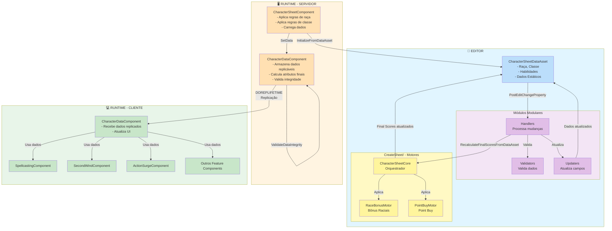

# Arquitetura do Projeto - MyProject2

## Visão Geral

Este documento descreve a arquitetura do projeto, baseada em princípios de design que garantem código limpo, manutenível, escalável e preparado para multiplayer.

## Princípios de Design

<details>
<summary style="background-color: #e8e8e8; padding: 4px 8px; border-radius: 4px;"><b>🎯 5 Princípios Fundamentais</b></summary>

> Os 5 princípios fundamentais que guiam a arquitetura do projeto:
>
> <details>
> <summary style="background-color: #d8d8d8; padding: 3px 6px; border-radius: 3px;">📊 1. Data-Driven</summary>
>
> > **Conceito:** Todas as regras vêm de Data Tables ou Data Assets, não de código hardcoded.
> >
> > **Benefícios:**
> >
> > - ✅ Designers podem modificar regras sem programadores
> > - ✅ Fácil adicionar novo conteúdo
> > - ✅ Suporte a localização
> > - ✅ Validação automática
> >
> > **Implementação:**
> >
> > - Use `UDataTable` para dados tabulares (raças, classes, itens)
> > - Use `UDataAsset` para configurações complexas (fichas de personagem)
> > - Valide dados no editor com `PostEditChangeProperty()`
> > - Use `FTableRowBase` para estruturas de dados
> >
> > **Exemplo:**
> >
> > ```cpp
> > // ✅ CORRETO - Data-Driven
> > UPROPERTY(EditDefaultsOnly, Category = "Data")
> > UDataTable* RaceDataTable;
> >
> > // ❌ ERRADO - Hardcoded
> > const float DwarfConstitutionBonus = 2.0f;
> > ```
>
> </details>
>
> <details>
> <summary style="background-color: #d8d8d8; padding: 3px 6px; border-radius: 3px;">🧩 2. Modularidade</summary>
>
> > **Conceito:** Código organizado por domínio, cada parte com responsabilidade única e clara.
> >
> > **Benefícios:**
> >
> > - ✅ Fácil manutenção
> > - ✅ Fácil expansão
> > - ✅ Código limpo e organizado
> > - ✅ Reutilização de componentes
> >
> > **Estrutura de Diretórios:**
> >
> > ```
> > Source/MyProject2/
> > ├── Characters/          # Personagens e raças
> > │   ├── Data/           # Data Assets de personagens
> > │   └── Components/      # Componentes de personagem
> > ├── Components/          # Componentes reutilizáveis
> > │   ├── Data/           # Componentes de dados
> > │   ├── Features/        # Componentes de features
> > │   └── UI/             # Componentes de UI
> > ├── Data/               # Data Assets e Data Tables
> > │   ├── Tables/         # Data Tables
> > │   └── Assets/         # Data Assets
> > ├── Gameplay/           # Mecânicas de jogo
> > │   ├── Abilities/      # Habilidades
> > │   └── Systems/        # Sistemas de jogo
> > └── Utils/              # Utilitários
> > ```
>
> </details>
>
> <details>
> <summary style="background-color: #d8d8d8; padding: 3px 6px; border-radius: 3px;">🛠️ 3. Editor-Friendly</summary>
>
> > **Conceito:** Sistema funciona perfeitamente no editor, permitindo configuração rápida sem rodar o jogo.
> >
> > **Benefícios:**
> >
> > - ✅ Designers podem trabalhar sem rodar o jogo
> > - ✅ Testes rápidos
> > - ✅ Iteração rápida
> > - ✅ Validação em tempo real
> >
> > **Implementação:**
> >
> > - Use `WITH_EDITOR` para código específico do editor
> > - Valide dados em `PostEditChangeProperty()`
> > - Use `UPROPERTY(EditAnywhere)` para propriedades editáveis
> > - Forneça feedback visual no editor quando possível
> >
> > **Exemplo:**
> >
> > ```cpp
> > #if WITH_EDITOR
> > void UCharacterSheetDataAsset::PostEditChangeProperty(FPropertyChangedEvent& PropertyChangedEvent)
> > {
> >     Super::PostEditChangeProperty(PropertyChangedEvent);
> >     ValidateData();
> > }
> > #endif
> > ```
>
> </details>
>
> <details>
> <summary style="background-color: #d8d8d8; padding: 3px 6px; border-radius: 3px;">🌐 4. Preparação para Multiplayer</summary>
>
> > **Conceito:** Sistema preparado para multiplayer desde o início, não precisa refatorar depois.
> >
> > **Benefícios:**
> >
> > - ✅ Não precisa refatorar depois
> > - ✅ Lógica autoritária correta desde o início
> > - ✅ Sincronização automática
> > - ✅ Escalável para servidor dedicado
> >
> > **Implementação:**
> >
> > - **SEMPRE** use `DOREPLIFETIME` para propriedades replicáveis
> > - **SEMPRE** valide RPCs com `WithValidation`
> > - **SEMPRE** execute lógica autoritária no servidor
> > - **SEMPRE** use `GetLocalRole()` para verificar autoridade
> > - **NUNCA** confie em dados do cliente sem validação
> >
> > **Exemplo:**
> >
> > ```cpp
> > // ✅ CORRETO - Replicação
> > void AMyCharacter::GetLifetimeReplicatedProps(TArray<FLifetimeProperty>& OutLifetimeProps) const
> > {
> >     Super::GetLifetimeReplicatedProps(OutLifetimeProps);
> >     DOREPLIFETIME(AMyCharacter, CharacterData);
> > }
> >
> > // ✅ CORRETO - RPC com validação
> > UFUNCTION(Server, Reliable, WithValidation)
> > void ServerTakeDamage(float DamageAmount);
> >
> > bool ServerTakeDamage_Validate(float DamageAmount)
> > {
> >     return DamageAmount >= 0.0f && DamageAmount <= 1000.0f;
> > }
> >
> > void ServerTakeDamage_Implementation(float DamageAmount)
> > {
> >     // Lógica autoritária apenas no servidor
> >     if (GetLocalRole() == ROLE_Authority)
> >     {
> >         Health -= DamageAmount;
> >     }
> > }
> > ```
>
> </details>
>
> <details>
> <summary style="background-color: #d8d8d8; padding: 3px 6px; border-radius: 3px;">🔧 5. Separação de Responsabilidades (Component-Based Architecture)</summary>
>
> > **Conceito:** Cada camada tem responsabilidade única e bem definida.
> >
> > **Benefícios:**
> >
> > - ✅ Separação clara entre configuração (Editor) e execução (Runtime)
> > - ✅ Fácil testar cada camada independentemente
> > - ✅ Preparado para GAS (dados em Component, lógica em Abilities)
> > - ✅ Replicação eficiente (apenas dados necessários)
>
> </details>

</details>

---

## Arquitetura em Camadas

<details>
<summary style="background-color: #e8e8e8; padding: 4px 8px; border-radius: 4px;"><b>📐 Arquitetura em 4 Camadas</b></summary>

> > **💡 Dica:** Veja o diagrama visual abaixo para entender melhor a arquitetura em camadas.
>
> <details>
> <summary style="background-color: #d8d8d8; padding: 3px 6px; border-radius: 3px;">📝 Camada 1: Data Assets (Editor/Configuração)</summary>
>
> > **Responsabilidade:** Armazenar configuração estática, não contém lógica.
> >
> > **Características:**
> >
> > - Herda de `UDataAsset`
> > - `UPROPERTY(EditDefaultsOnly)` - editável apenas em defaults
> > - Não é replicável (não precisa em runtime)
> > - Funciona apenas no editor para designers
> > - Exemplo: `UCharacterSheetDataAsset`
> >
> > **Padrão de Implementação:**
> >
> > ```cpp
> > UCLASS(BlueprintType)
> > class MYPROJECT2_API UCharacterSheetDataAsset : public UDataAsset
> > {
> >     GENERATED_BODY()
> >
> > public:
> >     UPROPERTY(EditDefaultsOnly, Category = "Character")
> >     ERace Race;
> >
> >     UPROPERTY(EditDefaultsOnly, Category = "Character")
> >     EClass Class;
> >
> >     UPROPERTY(EditDefaultsOnly, Category = "Character")
> >     TArray<FAbilityScore> BaseAbilityScores;
> >
> > #if WITH_EDITOR
> >     virtual void PostEditChangeProperty(FPropertyChangedEvent& PropertyChangedEvent) override;
> > #endif
> > };
> > ```
>
> </details>
>
> <details>
> <summary style="background-color: #d8d8d8; padding: 3px 6px; border-radius: 3px;">🌉 Camada 2: Bridge Components (Aplicação de Regras)</summary>
>
> > **Responsabilidade:** Fazer ponte entre Data Asset e Runtime Component, aplicar regras de raça e classe.
> >
> > **Características:**
> >
> > - Herda de `UActorComponent`
> > - Executa apenas no servidor/local (não replicável)
> > - Aplica regras de raça e classe (`ApplyRaceBonuses()`, `ApplyClassFeatures()`)
> > - Carrega dados do Data Asset para Runtime Component
> > - Exemplo: `UCharacterSheetComponent`
> >
> > **Padrão de Implementação:**
> >
> > ```cpp
> > UCLASS(ClassGroup=(Custom), meta=(BlueprintSpawnableComponent))
> > class MYPROJECT2_API UCharacterSheetComponent : public UActorComponent
> > {
> >     GENERATED_BODY()
> >
> > public:
> >     UFUNCTION(BlueprintCallable, Category = "Character")
> >     void InitializeFromDataAsset(UCharacterSheetDataAsset* DataAsset);
> >
> >     UFUNCTION(BlueprintCallable, Category = "Character")
> >     void ApplyRaceBonuses();
> >
> >     UFUNCTION(BlueprintCallable, Category = "Character")
> >     void ApplyClassFeatures();
> >
> > private:
> >     UPROPERTY()
> >     UCharacterSheetDataAsset* SourceDataAsset;
> >
> >     UPROPERTY()
> >     class UCharacterDataComponent* CharacterDataComponent;
> > };
> > ```
>
> </details>
>
> <details>
> <summary style="background-color: #d8d8d8; padding: 3px 6px; border-radius: 3px;">💾 Camada 3: Runtime Data Components (Dados Replicáveis)</summary>
>
> > **Responsabilidade:** Armazenar dados do personagem em runtime, todas as propriedades replicáveis.
> >
> > **Características:**
> >
> > - Herda de `UActorComponent`
> > - Todas as propriedades são replicáveis (`DOREPLIFETIME`)
> > - Calcula atributos finais, HP, proficiência
> > - Preparado para migração futura para GAS Attributes
> > - Exemplo: `UCharacterDataComponent`
> >
> > **Padrão de Implementação:**
> >
> > ```cpp
> > UCLASS(ClassGroup=(Custom), meta=(BlueprintSpawnableComponent))
> > class MYPROJECT2_API UCharacterDataComponent : public UActorComponent
> > {
> >     GENERATED_BODY()
> >
> > public:
> >     virtual void GetLifetimeReplicatedProps(TArray<FLifetimeProperty>& OutLifetimeProps) const override;
> >
> >     UPROPERTY(Replicated, ReplicatedUsing = OnRep_Health)
> >     float Health;
> >
> >     UPROPERTY(Replicated)
> >     float MaxHealth;
> >
> >     UPROPERTY(Replicated)
> >     FAbilityScores FinalAbilityScores;
> >
> >     UFUNCTION()
> >     void OnRep_Health();
> >
> >     UFUNCTION(BlueprintCallable, Category = "Character")
> >     void CalculateFinalAttributes();
> >
> >     UFUNCTION(BlueprintCallable, Category = "Character")
> >     void CalculateMaxHealth();
> > };
> > ```
>
> </details>
>
> <details>
> <summary style="background-color: #d8d8d8; padding: 3px 6px; border-radius: 3px;">⚡ Camada 4: Feature Components (Lógica Específica)</summary>
>
> > **Responsabilidade:** Gerenciar features específicas de classes (spells, abilities, etc.).
> >
> > **Características:**
> >
> > - Herda de `UActorComponent`
> > - Cada um gerencia uma feature específica
> > - Podem ser migrados para GAS Abilities no futuro
> > - Exemplos: `USpellcastingComponent`, `USecondWindComponent`, `UActionSurgeComponent`
> >
> > **Padrão de Implementação:**
> >
> > ```cpp
> > UCLASS(ClassGroup=(Custom), meta=(BlueprintSpawnableComponent))
> > class MYPROJECT2_API USpellcastingComponent : public UActorComponent
> > {
> >     GENERATED_BODY()
> >
> > public:
> >     virtual void GetLifetimeReplicatedProps(TArray<FLifetimeProperty>& OutLifetimeProps) const override;
> >
> >     UFUNCTION(BlueprintCallable, Category = "Spellcasting")
> >     void CastSpell(int32 SpellSlot);
> >
> >     UFUNCTION(Server, Reliable, WithValidation)
> >     void ServerCastSpell(int32 SpellSlot);
> >
> >     UPROPERTY(Replicated)
> >     TArray<FSpellSlot> SpellSlots;
> >
> >     UPROPERTY(Replicated)
> >     int32 SpellSlotsUsed;
> > };
> > ```
>
> </details>

> <details>
> <summary style="background-color: #e8e8e8; padding: 4px 8px; border-radius: 4px;"><b>📊 Diagrama Visual das Camadas</b></summary>
>
> >
>
> ```mermaid
> graph LR
>     subgraph Layer1["Camada 1: Data Assets"]
>         DA1[UCharacterSheetDataAsset<br/>📝 Editor Only<br/>⚙️ Configuração Estática]
>     end
>
>     subgraph Layer2["Camada 2: Bridge Components"]
>         BC1[UCharacterSheetComponent<br/>🔗 Ponte Data → Runtime<br/>📋 Aplica Regras]
>     end
>
>     subgraph Layer3["Camada 3: Runtime Data"]
>         RD1[UCharacterDataComponent<br/>💾 Dados Replicáveis<br/>📊 Atributos Finais]
>     end
>
>     subgraph Layer4["Camada 4: Features"]
>         F1[USpellcastingComponent]
>         F2[USecondWindComponent]
>         F3[UActionSurgeComponent]
>     end
>
>     DA1 -->|InitializeFromDataAsset| BC1
>     BC1 -->|SetData| RD1
>     RD1 -->|Usa dados| F1
>     RD1 -->|Usa dados| F2
>     RD1 -->|Usa dados| F3
>
>     style Layer1 fill:#e3f2fd
>     style Layer2 fill:#fff3e0
>     style Layer3 fill:#f3e5f5
>     style Layer4 fill:#e8f5e9
> ```
>
> </details>

</details>

---

## Fluxo de Dados

<details>
<summary style="background-color: #e8e8e8; padding: 4px 8px; border-radius: 4px;"><b>🔄 Diagrama de Fluxo de Dados</b></summary>

>



</details>

---

## Arquitetura CreateSheet/

<details>
<summary style="background-color: #e8e8e8; padding: 4px 8px; border-radius: 4px;"><b>⚙️ Motores Desacoplados para Criação de Personagem</b></summary>

> O sistema utiliza uma arquitetura modular com motores desacoplados para cálculo de ability scores finais. Esta arquitetura permite reutilização em diferentes contextos (Data Asset, Widgets) e facilita testes e manutenção.
>
> ### Componentes Principais
>
> <details>
> <summary style="background-color: #d8d8d8; padding: 3px 6px; border-radius: 3px;">FCharacterSheetCore - Orquestrador</summary>
>
> > **Localização:** `Source/MyProject2/CreateSheet/Core/CharacterSheetCore.h`
> >
> > **Responsabilidade:** Orquestrar todos os motores de criação de personagem de forma genérica.
> >
> > **Características:**
> >
> > - Função estática `RecalculateFinalScores()` que coordena todos os motores
> > - Recebe `FCharacterSheetData` (estrutura genérica) ao invés de objetos concretos
> > - Reseta scores para base (8) e aplica cada motor sequencialmente
> > - Funciona tanto no Data Asset quanto em Widgets
> >
> > **Fórmula de Cálculo:**
> >
> > ```
> > FinalScore = 8 (base) + RacialBonus + PointBuyAllocation
> > ```
> >
> > **Fluxo:**
> >
> > 1. Reseta todos os Final Scores para 8 (base)
> > 2. Aplica `FRaceBonusMotor::ApplyRacialBonuses()`
> > 3. Aplica `FPointBuyMotor::ApplyPointBuy()`
>
> </details>
>
> <details>
> <summary style="background-color: #d8d8d8; padding: 3px 6px; border-radius: 3px;">FCharacterSheetData - Estrutura Genérica</summary>
>
> > **Localização:** `Source/MyProject2/CreateSheet/Core/CharacterSheetData.h`
> >
> > **Responsabilidade:** Estrutura genérica de dados que permite o Core funcionar em diferentes contextos.
> >
> > **Características:**
> >
> > - Struct C++ normal (não USTRUCT) - contém ponteiros e não precisa ser exposta ao Blueprint
> > - Contém dados de entrada (Point Buy, Race, Subrace, Custom Choices)
> > - Contém referências de saída (ponteiros para Final Scores)
> > - Permite reutilização: mesmo Core funciona no Data Asset e em Widgets
> >
> > **Princípio:** "Program to an interface, not an implementation" (Design Patterns)
>
> </details>
>
> <details>
> <summary style="background-color: #d8d8d8; padding: 3px 6px; border-radius: 3px;">FRaceBonusMotor - Motor de Bônus Raciais</summary>
>
> > **Localização:** `Source/MyProject2/CreateSheet/RaceBonus/RaceBonusMotor.h`
> >
> > **Responsabilidade:** Calcular e aplicar bônus raciais nos Final Scores.
> >
> > **Características:**
> >
> > - Motor independente: não conhece Point Buy, apenas aplica bônus raciais
> > - Recebe `FCharacterSheetData` (dados puros), não objetos concretos
> > - Usa `FRaceBonusHelpers` para cálculos puros
> > - Suporta Variant Human com escolhas customizadas
> >
> > **Fluxo:**
> >
> > 1. Busca RaceRow e SubraceRow usando `DataTableHelpers`
> > 2. Calcula bônus usando `FRaceBonusHelpers::CalculateRacialBonuses()`
> > 3. Incrementa Final Scores usando `FRaceBonusHelpers::IncrementFinalScoresWithRacialBonuses()`
>
> </details>
>
> <details>
> <summary style="background-color: #d8d8d8; padding: 3px 6px; border-radius: 3px;">FPointBuyMotor - Motor de Point Buy</summary>
>
> > **Localização:** `Source/MyProject2/CreateSheet/PointBuy/PointBuyMotor.h`
> >
> > **Responsabilidade:** Aplicar alocação de Point Buy nos Final Scores com validação automática.
> >
> > **Características:**
> >
> > - Motor independente: não conhece bônus raciais, apenas aplica Point Buy
> > - Valida automaticamente se não excede 27 pontos
> > - Ajusta automaticamente se exceder (reduz do final da fila)
> > - Retorna `FPointBuyResult` com feedback para o caller ajustar a UI
> >
> > **Fluxo:**
> >
> > 1. Converte dados de entrada para `TMap<FName, int32>`
> > 2. Calcula custo total usando `CharacterSheetHelpers::CalculateTotalPointBuyCost()`
> > 3. Se exceder 27 pontos, ajusta usando `AdjustPointBuyAllocation()`
> > 4. Incrementa Final Scores usando `CalculationHelpers::IncrementFinalScoresWithPointBuy()`
> > 5. Retorna `FPointBuyResult` com feedback
>
> </details>
>
> ### Independência dos Motores
>
> **Princípio Fundamental:** Motores são completamente desacoplados e não conhecem uns aos outros.
>
> - ✅ `FRaceBonusMotor` não conhece `FPointBuyMotor`
> - ✅ `FPointBuyMotor` não conhece `FRaceBonusMotor`
> - ✅ Ambos apenas incrementam Final Scores (não resetam)
> - ✅ `FCharacterSheetCore` é responsável por resetar e orquestrar
>
> **Benefícios:**
>
> - ✅ Fácil testar cada motor isoladamente
> - ✅ Fácil adicionar novos motores (ex: LevelUpMotor, FeatMotor)
> - ✅ Fácil modificar ordem de aplicação
> - ✅ Reutilização em diferentes contextos
>
> ### Diagrama de Arquitetura
>
> ```mermaid
> graph TB
>     subgraph Core["CharacterSheetCore"]
>         CoreFunc[RecalculateFinalScores]
>     end
>
>     subgraph Data["FCharacterSheetData"]
>         Input[Point Buy, Race, Subrace]
>         Output[Final Scores - Referências]
>     end
>
>     subgraph RaceMotor["RaceBonusMotor"]
>         RaceApply[ApplyRacialBonuses]
>         RaceHelpers[RaceBonusHelpers]
>     end
>
>     subgraph PointBuyMotor["PointBuyMotor"]
>         PointBuyApply[ApplyPointBuy]
>         PointBuyValidator[PointBuyValidator]
>     end
>
>     CoreFunc -->|Reseta para base 8| Output
>     CoreFunc -->|Aplica| RaceApply
>     CoreFunc -->|Aplica| PointBuyApply
>     RaceApply -->|Usa| RaceHelpers
>     PointBuyApply -->|Valida| PointBuyValidator
>     RaceApply -->|Incrementa| Output
>     PointBuyApply -->|Incrementa| Output
>     Input -->|Dados de entrada| CoreFunc
>
>     style Core fill:#fff59d
>     style Data fill:#e1f5ff
>     style RaceMotor fill:#c8e6c9
>     style PointBuyMotor fill:#c8e6c9
> ```
>
> **📖 Para mais detalhes sobre a implementação, veja os arquivos em `Source/MyProject2/CreateSheet/`**

</details>

---

## Preparação para GAS (Gameplay Ability System)

<details>
<summary style="background-color: #e8e8e8; padding: 4px 8px; border-radius: 4px;"><b>🔮 Migração Futura para GAS</b></summary>

> **Futuro:** Migrar dados para GAS Attributes e lógica para GAS Abilities.
>
> **Preparação Atual:**
>
> - ✅ Dados em Components (fácil migrar para Attributes)
> - ✅ Lógica em Components separados (fácil migrar para Abilities)
> - ✅ Interfaces bem definidas (fácil refatorar)
> - ✅ Replicação já configurada (GAS usa mesmo sistema)
>
> **Migração Futura:**
>
> ```
> CharacterDataComponent → GAS Attributes
> Feature Components → GAS Abilities
> CharacterSheetComponent → GAS Gameplay Effects
> ```

</details>

---

## Regras de Implementação

<details>
<summary style="background-color: #e8e8e8; padding: 4px 8px; border-radius: 4px;"><b>📋 Guia de Regras e Padrões</b></summary>

> ### Ao Criar Novos Componentes
>
> 1. ✅ **SEMPRE** defina responsabilidade única
> 2. ✅ **SEMPRE** use `UPROPERTY()` apropriado (EditAnywhere, Replicated, etc.)
> 3. ✅ **SEMPRE** implemente `GetLifetimeReplicatedProps()` se tiver dados replicáveis
> 4. ✅ **SEMPRE** valide dados no editor quando possível
> 5. ❌ **NUNCA** misture lógica de diferentes camadas
>
> ### Ao Criar Data Assets
>
> 1. ✅ **SEMPRE** herde de `UDataAsset`
> 2. ✅ **SEMPRE** use `UPROPERTY(EditDefaultsOnly)`
> 3. ❌ **NUNCA** adicione lógica, apenas dados
> 4. ✅ **SEMPRE** valide dados no editor
>
> ### Ao Criar Features
>
> 1. ✅ **SEMPRE** crie componente separado para cada feature
> 2. ✅ **SEMPRE** use interfaces para comunicação
> 3. ✅ **SEMPRE** prepare para migração futura para GAS
> 4. ❌ **NUNCA** acople features diretamente
>
> ### Ao Implementar Multiplayer
>
> 1. ✅ **SEMPRE** use `DOREPLIFETIME` para propriedades replicáveis
> 2. ✅ **SEMPRE** valide RPCs com `WithValidation`
> 3. ✅ **SEMPRE** execute lógica autoritária no servidor
> 4. ✅ **SEMPRE** use `GetLocalRole() == ROLE_Authority` para verificar autoridade
> 5. ❌ **NUNCA** confie em dados do cliente sem validação

</details>

---

## Checklist de Arquitetura

<details>
<summary style="background-color: #e8e8e8; padding: 4px 8px; border-radius: 4px;"><b>✅ Checklist Antes de Criar Novo Código</b></summary>

> Antes de criar novo código, verifique:
>
> - [ ] É Data-Driven? (usa Data Tables/Assets?)
> - [ ] É Modular? (responsabilidade única?)
> - [ ] Funciona no Editor? (pode configurar sem rodar?)
> - [ ] É Multiplayer-Ready? (replicação correta?)
> - [ ] Separação de Responsabilidades? (camada correta?)
> - [ ] Segue padrões de nomenclatura?
> - [ ] Está documentado?
> - [ ] Compila sem warnings?

</details>

---

## Estrutura de Arquivos Recomendada

<details>
<summary style="background-color: #e8e8e8; padding: 4px 8px; border-radius: 4px;"><b>📁 Organização de Diretórios e Arquivos</b></summary>

> ```mermaid
> graph TD
>     Root[Source/MyProject2/] --> Chars[Characters/]
>     Root --> CreateSheet[CreateSheet/]
>     Root --> Comp[Components/]
>     Root --> Data[Data/]
>     Root --> Gameplay[Gameplay/]
>     Root --> Utils[Utils/]
>
>     Chars --> CharsData[Data/<br/>CharacterSheetDataAsset]
>     Chars --> CharsComp[Components/<br/>CharacterSheetComponent<br/>CharacterDataComponent]
>
>     CreateSheet --> CreateSheetCore[Core/<br/>CharacterSheetCore<br/>CharacterSheetData]
>     CreateSheet --> CreateSheetRace[RaceBonus/<br/>RaceBonusMotor<br/>RaceBonusHelpers]
>     CreateSheet --> CreateSheetPointBuy[PointBuy/<br/>PointBuyMotor<br/>PointBuyValidator]
>
>     Comp --> CompFeat[Features/<br/>SpellcastingComponent<br/>SecondWindComponent]
>     Comp --> CompData[Data/]
>
>     Data --> DataTab[Tables/<br/>RaceDataTable<br/>ClassDataTable]
>     Data --> DataAssets[Assets/]
>
>     Gameplay --> GameplayAbil[Abilities/]
>     Gameplay --> GameplaySys[Systems/]
>
>     Utils --> UtilsCalc[CalculationHelpers]
>     Utils --> UtilsChar[CharacterSheetHelpers]
>     Utils --> UtilsData[DataTableHelpers]
>     Utils --> UtilsVal[ValidationHelpers]
>     Utils --> UtilsFmt[FormattingHelpers]
>     Utils --> UtilsComp[ComponentHelpers]
>
>     style Root fill:#2196f3,color:#fff
>     style Chars fill:#4caf50,color:#fff
>     style CreateSheet fill:#ffc107,color:#000
>     style Comp fill:#ff9800,color:#fff
>     style Data fill:#9c27b0,color:#fff
>     style Gameplay fill:#f44336,color:#fff
>     style Utils fill:#00bcd4,color:#fff
> ```
>
> ### Estrutura Detalhada
>
> ```
> Source/MyProject2/
> ├── Characters/
> │   ├── Data/
> │   │   ├── CharacterSheetDataAsset.h
> │   │   ├── CharacterSheetDataAsset.cpp
> │   │   ├── Handlers/
> │   │   │   ├── CharacterSheetDataAssetHandlers.h
> │   │   │   └── CharacterSheetDataAssetHandlers.cpp
> │   │   ├── Validators/
> │   │   │   ├── CharacterSheetDataAssetValidators.h
> │   │   │   └── CharacterSheetDataAssetValidators.cpp
> │   │   ├── Updaters/
> │   │   │   ├── CharacterSheetDataAssetUpdaters.h
> │   │   │   └── CharacterSheetDataAssetUpdaters.cpp
> │   │   ├── Helpers/
> │   │   │   ├── CharacterSheetDataAssetHelpers.h
> │   │   │   ├── CharacterSheetDataAssetHelpers.cpp
> │   │   │   ├── ValidationGuard.h
> │   │   │   └── ValidationGuard.cpp
> │   │   └── GetOptions/
> │   │       ├── CharacterSheetDataAssetGetOptions.h
> │   │       └── CharacterSheetDataAssetGetOptions.cpp
> │   └── Components/
> │       ├── CharacterSheetComponent.h
> │       ├── CharacterSheetComponent.cpp
> │       ├── CharacterDataComponent.h
> │       └── CharacterDataComponent.cpp
> ├── CreateSheet/
> │   ├── Core/
> │   │   ├── CharacterSheetCore.h
> │   │   ├── CharacterSheetCore.cpp
> │   │   └── CharacterSheetData.h
> │   ├── RaceBonus/
> │   │   ├── RaceBonusMotor.h
> │   │   ├── RaceBonusMotor.cpp
> │   │   ├── RaceBonusHelpers.h
> │   │   └── RaceBonusHelpers.cpp
> │   └── PointBuy/
> │       ├── PointBuyMotor.h
> │       ├── PointBuyMotor.cpp
> │       ├── PointBuyValidator.h
> │       ├── PointBuyValidator.cpp
> │       └── PointBuyResult.h
> ├── Components/
> │   ├── Features/
> │   │   ├── SpellcastingComponent.h
> │   │   ├── SpellcastingComponent.cpp
> │   │   ├── SecondWindComponent.h
> │   │   └── SecondWindComponent.cpp
> │   └── Data/
> │       └── (componentes de dados genéricos)
> ├── Data/
> │   ├── Tables/
> │   │   ├── RaceDataTable.h
> │   │   ├── ClassDataTable.h
> │   │   ├── BackgroundDataTable.h
> │   │   └── FeatDataTable.h
> │   └── Assets/
> │       └── (data assets)
> ├── Gameplay/
> │   ├── Abilities/
> │   └── Systems/
> └── Utils/
>     ├── CalculationHelpers.h
>     ├── CalculationHelpers.cpp
>     ├── CharacterSheetHelpers.h
>     ├── CharacterSheetHelpers.cpp
>     ├── DataTableHelpers.h
>     ├── DataTableHelpers.cpp
>     ├── ValidationHelpers.h
>     ├── ValidationHelpers.cpp
>     ├── FormattingHelpers.h
>     ├── FormattingHelpers.cpp
>     ├── ComponentHelpers.h
>     └── ComponentHelpers.cpp
> ```

</details>

---

### Organização Modular do CharacterSheetDataAsset

<details>
<summary style="background-color: #e8e8e8; padding: 4px 8px; border-radius: 4px;"><b>🔧 Arquitetura Modular do CharacterSheetDataAsset</b></summary>

> O `CharacterSheetDataAsset` utiliza uma arquitetura modular baseada em responsabilidades separadas, seguindo princípios de Clean Code e Design Patterns. A organização em módulos facilita manutenção, testes e extensibilidade.
>
> **Estrutura Modular:**
>
> ```mermaid
> graph TD
>     CSDA[CharacterSheetDataAsset] --> H[Handlers]
>     CSDA --> V[Validators]
>     CSDA --> U[Updaters]
>     CSDA --> HLP[Helpers]
>     CSDA --> GO[GetOptions]
>     CSDA --> T[Types]
>
>     H --> |Handle Property Changes| CSDA
>     V --> |Validate Data| CSDA
>     U --> |Update Calculated Fields| CSDA
>     HLP --> |Helper Functions| CSDA
>     GO --> |Dropdown Options| CSDA
>     T --> |Type Definitions| CSDA
> ```
>
> **Módulos e Responsabilidades:**
>
> #### Handlers (`Handlers/CharacterSheetDataAssetHandlers`)
>
> **Responsabilidade:** Processar mudanças de propriedades no editor via `PostEditChangeProperty()`.
>
> **Padrão:** Map/Table-Driven com ponteiros de função estáticos (Lookup Table Pattern).
>
> **Funções principais:**
>
> - `HandleRaceChange()` - Processa mudanças em raça/sub-raça
> - `HandleAbilityScoresChange()` - Processa mudanças em ability scores
> - `HandleClassLevelsChange()` - Processa mudanças em níveis de classe
> - `HandleBackgroundChange()` - Processa mudanças em background
> - `HandleVariantHumanChoicesChange()` - Processa escolhas de Variant Human
> - `HandleDataTableChange()` - Processa seleção de Data Tables
>
> **Exemplo de uso:**
>
> ```cpp
> // PostEditChangeProperty usa lookup table para encontrar handler
> if (PropertyHandlerFunction *HandlerPtr = PropertyHandlers.Find(PropertyName))
> {
>     (*HandlerPtr)(this, PropertyName);
> }
> ```
>
> #### Validators (`Validators/CharacterSheetDataAssetValidators`)
>
> **Responsabilidade:** Validar integridade e consistência dos dados.
>
> **Funções principais:**
>
> - `ValidatePointBuy()` - Valida sistema Point Buy (27 pontos, scores 8-15)
> - `ValidateTotalLevel()` - Valida nível total (máximo 20)
> - `ValidateVariantHumanChoices()` - Valida escolhas de Variant Human
>
> **Características:**
>
> - Funções puras (sem side effects além de validação)
> - Retornam void (modificam Asset diretamente se necessário)
> - Logam erros quando dados inválidos
>
> #### Updaters (`Updaters/CharacterSheetDataAssetUpdaters`)
>
> **Responsabilidade:** Atualizar campos calculados baseados em dados do personagem.
>
> **Funções principais:**
>
> - `UpdateRacialBonuses()` - Calcula e aplica bônus raciais nos ability scores
> - `UpdateCalculatedFields()` - Atualiza proficiências, features disponíveis
> - `UpdateVariantHumanFlag()` - Atualiza flag bIsVariantHuman
> - `UpdateSheetVisibility()` - Controla visibilidade de categorias no editor
>
> **Características:**
>
> - Executam cálculos baseados em dados atuais
> - Atualizam campos derivados automaticamente
> - Garantem consistência entre dados relacionados
>
> #### Helpers (`Helpers/CharacterSheetDataAssetHelpers`)
>
> **Responsabilidade:** Funções auxiliares reutilizáveis.
>
> **Funções principais:**
>
> - `InitializeDefaultAbilityScores()` - Inicializa ability scores padrão (todos em 8)
> - `ResetVariantHumanChoices()` - Reseta escolhas de Variant Human
>
> **Características:**
>
> - Funções puras e parametrizadas
> - Reutilizáveis em diferentes contextos
> - Testáveis isoladamente
>
> #### GetOptions (`GetOptions/CharacterSheetDataAssetGetOptions`)
>
> **Responsabilidade:** Lógica para popular dropdowns no editor.
>
> **Funções principais:**
>
> - `GetRaceNames()` - Retorna nomes de raças disponíveis
> - `GetSubraceNames()` - Retorna sub-raças para raça selecionada
> - `GetClassNames()` - Retorna nomes de classes
> - `GetAbilityScoreNames()` - Retorna nomes dos 6 atributos
> - `GetAvailableFeatNames()` - Retorna feats disponíveis
>
> **Nota:** As funções `UFUNCTION(CallInEditor)` devem permanecer na classe `UCharacterSheetDataAsset` (requisito do Unreal Engine), mas a lógica foi extraída para este módulo.
>
> #### Types (`CharacterSheetDataAssetTypes.h`)
>
> **Responsabilidade:** Definições de tipos compartilhados.
>
> **Tipos definidos:**
>
> - `FAbilityScoreEntry` - Estrutura para ability scores (BaseScore, RacialBonus, FinalScore)
>
> **Benefício:** Evita dependências circulares e facilita reutilização.
>
> **Fluxo de Validação e Atualização:**
>
> ```mermaid
> sequenceDiagram
>     participant Editor
>     participant CSDA as CharacterSheetDataAsset
>     participant Handler
>     participant Validator
>     participant Updater
>
>     Editor->>CSDA: Modifica propriedade
>     CSDA->>Handler: PostEditChangeProperty
>     Handler->>Validator: ValidatePointBuy
>     Handler->>Validator: ValidateTotalLevel
>     Handler->>Updater: UpdateRacialBonuses
>     Handler->>Updater: UpdateCalculatedFields
>     Updater-->>CSDA: Dados atualizados
>     CSDA-->>Editor: UI atualizada
> ```
>
> **Vantagens da Organização Modular:**
>
> - **Manutenibilidade:** Cada módulo tem responsabilidade única e clara
> - **Testabilidade:** Funções estáticas podem ser testadas isoladamente
> - **Extensibilidade:** Fácil adicionar novos handlers, validators ou updaters
> - **Clean Code:** Funções pequenas (< 50 linhas), focadas, reutilizáveis
> - **Performance:** Lookup table com ponteiros de função estáticos (sem overhead de std::function)

</details>

---

## Referências

<details>
<summary style="background-color: #e8e8e8; padding: 4px 8px; border-radius: 4px;"><b>📚 Links e Documentação Externa</b></summary>

> - [Unreal Engine 5.7 Documentation](https://docs.unrealengine.com/5.7/)
> - [Replication Documentation](https://docs.unrealengine.com/5.7/en-US/replication-in-unreal-engine/)
> - [Component System](https://docs.unrealengine.com/5.7/en-US/components-in-unreal-engine/)
> - [Data Assets](https://docs.unrealengine.com/5.7/en-US/data-assets-in-unreal-engine/)

</details>
