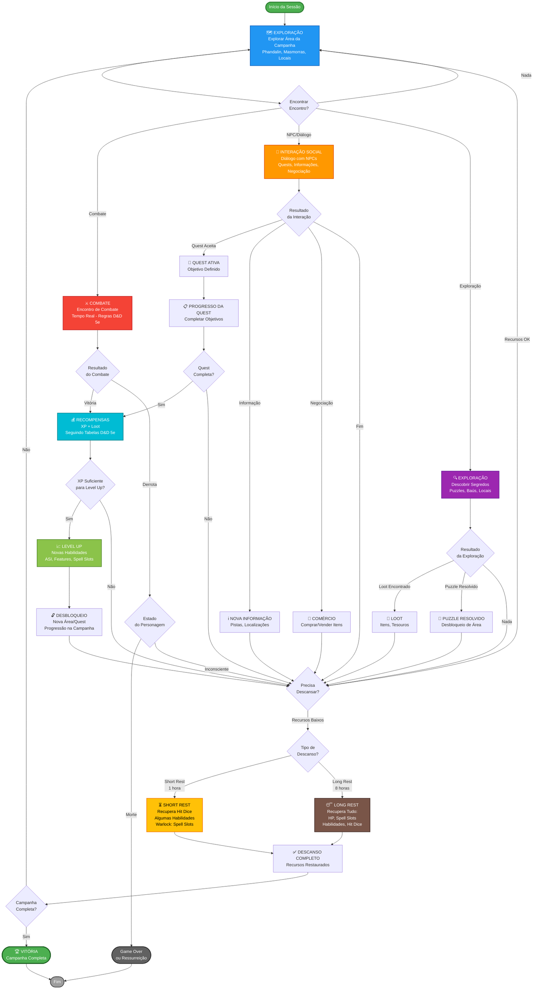

# 2.1. Core Loop (Loop Central)

---

<details open>
<summary style="background-color: #e8e8e8; padding: 4px 8px; border-radius: 4px;"><b>🔄 Core Loop</b></summary>

> O ciclo de atividades repetitivas e gratificantes que define a experiência do jogo.

</details>

---

## Fluxo do Core Loop

```
1. Explorar área da campanha (Phandalin, masmorras, locais)
   ↓
2. Encontrar combate/quest/desafio
   ↓
3. Resolver desafio (combate, puzzle, diálogo)
   ↓
4. Ganhar XP e loot (seguindo regras D&D 5e)
   ↓
5. Level up (quando atingir XP necessário)
   ↓
6. Desbloquear nova área/quest da campanha
   ↓
7. Explorar próxima área (volta ao passo 1)
```

## Tempo Médio do Loop

**10-30 minutos por ciclo** (dependendo da complexidade do desafio)

## Pontos de Recompensa

- Ganho de XP após combates/quests
- Loot de inimigos e baús (baseado na campanha oficial)
- Level up e novas habilidades (seguindo D&D 5e)
- Progressão na narrativa da campanha

## Diagrama Visual



**Legenda dos Pilares D&D 5e:**

- 🗺️ **Exploração:** Explorar o mundo, descobrir locais, encontrar segredos
- ⚔️ **Combate:** Encontros de combate em tempo real seguindo regras D&D 5e
- 💬 **Interação Social:** Diálogos, negociações, coleta de informações com NPCs
- ⏳ **Short Rest (1 hora):** Recupera Hit Dice, algumas habilidades (ex: Warlock spell slots)
- 😴 **Long Rest (8 horas):** Recupera tudo (HP, Spell Slots, habilidades, Hit Dice)

---

**Navegação:** [← Voltar ao Índice](index.md) | [→ Próxima: Sistemas de Personagem](sistemas-personagem.md)
