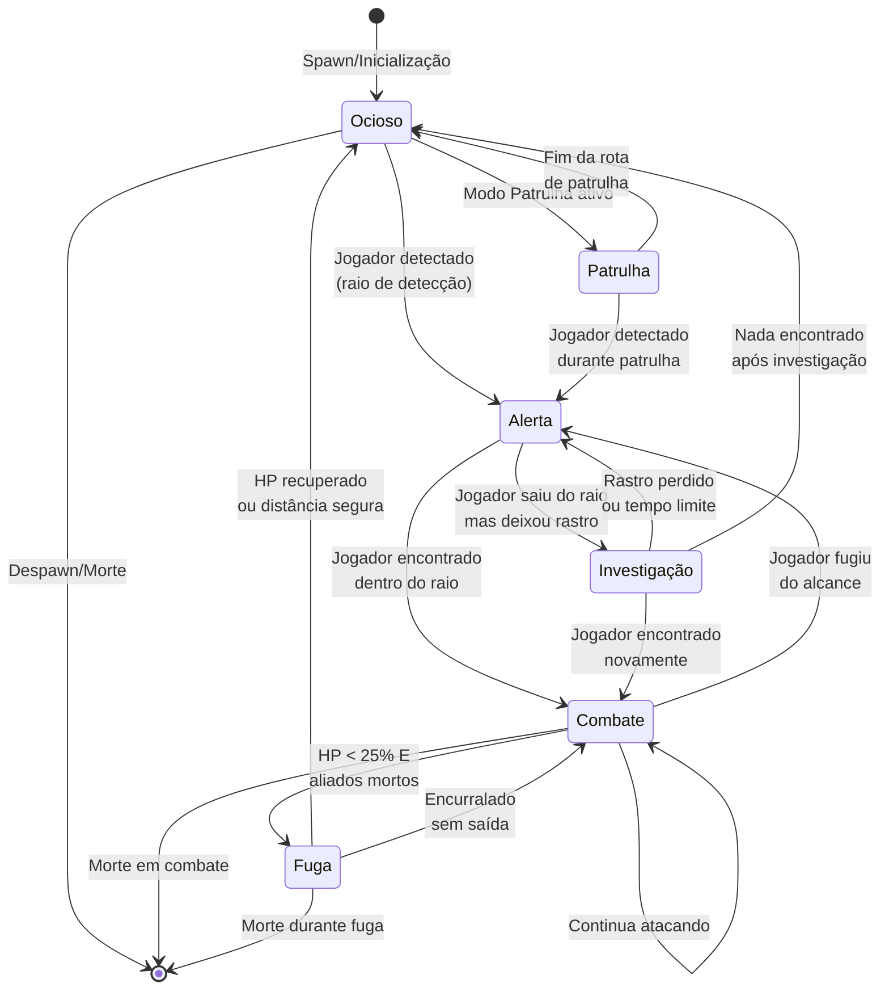

# 3.2. Máquinas de Estados Finitos (FSM)

---

<details open>
<summary style="background-color: #e8e8e8; padding: 4px 8px; border-radius: 4px;"><b>🔄 Máquinas de Estados Finitos</b></summary>

> Diagramas de estado e gatilhos de transição para cada tipo de IA.

</details>

---

## Estados Básicos de IA

```
Ocioso → Alerta → Investigação → Combate → Fuga
```

## Gatilhos de Transição Detalhados

<details>
<summary style="background-color: #d8d8d8; padding: 3px 6px; border-radius: 3px;">⚡ Condições de Transição</summary>

> **Ocioso → Alerta:**
>
> - Jogador entra no raio de detecção (varia por criatura: 10-15m)
> - Jogador faz barulho (ataque, magia, quebra objeto)
> - Aliado detecta jogador e alerta (comunicação entre inimigos)
>
> **Alerta → Investigação:**
>
> - Jogador sai do raio de detecção mas deixa rastro
> - Rastros: sangue, pegadas, objetos quebrados, portas abertas
> - Tempo limite: 30-60 segundos de investigação
>
> **Alerta → Combate:**
>
> - Jogador encontrado dentro do raio de detecção
> - Jogador ataca primeiro
> - Aliado entra em combate
>
> **Investigação → Combate:**
>
> - Jogador encontrado durante investigação
> - Jogador ataca durante investigação
>
> **Investigação → Alerta/Ocioso:**
>
> - Nada encontrado após investigação completa
> - Rastro perdido ou tempo limite excedido
>
> **Combate → Fuga:**
>
> - HP < 25% (ou valor específico da criatura)
> - E aliados mortos ou distantes
> - E jogador muito forte (nível muito maior)
>
> **Combate → Alerta:**
>
> - Jogador foge do alcance (> 20m)
> - Jogador se esconde com sucesso
> - Tempo sem contato: 10-15 segundos
>
> **Fuga → Ocioso:**
>
> - Distância segura alcançada (> 40-50m)
> - HP recuperado (se tiver regeneração)
> - Aliados chegam para ajudar
>
> **Fuga → Combate:**
>
> - Encurralado (sem saída)
> - Aliados chegam para ajudar
> - HP recuperado significativamente

</details>

## Diagrama Visual

### FSM Básica (Estados Principais)



### FSM por Tipo de Comportamento

<details>
<summary style="background-color: #d8d8d8; padding: 3px 6px; border-radius: 3px;">⚔️ Agressivo (Goblin, Bugbear, Orc)</summary>

> **Características:**
>
> - Ataca imediatamente ao detectar jogador
> - Não foge facilmente
> - Mantém combate até HP muito baixo
>
> ```mermaid
> stateDiagram-v2
>     [*] --> Ocioso
>
>     Ocioso --> Combate: Jogador detectado<br/>(transição rápida)
>
>     Combate --> Combate: HP > 10%<br/>Continua atacando
>     Combate --> Fuga: HP < 10% E<br/>sem aliados
>
>     Fuga --> Combate: Aliados chegam<br/>ou HP recuperado
>     Fuga --> Ocioso: Distância segura<br/>(> 50m)
>
>     Combate --> [*]: Morte
>     Fuga --> [*]: Morte
> ```

</details>

<details>
<summary style="background-color: #d8d8d8; padding: 3px 6px; border-radius: 3px;">🛡️ Defensivo (Nothic, Flameskull)</summary>

> **Características:**
>
> - Mantém distância
> - Usa ataques à distância
> - Foge se jogador se aproximar muito
>
> ```mermaid
> stateDiagram-v2
>     [*] --> Ocioso
>
>     Ocioso --> Alerta: Jogador detectado<br/>a longa distância
>
>     Alerta --> Combate: Jogador em alcance<br/>de ataque à distância
>     Alerta --> Fuga: Jogador muito próximo<br/>(< 5m)
>
>     Combate --> Fuga: Jogador se aproxima<br/>(< 5m) OU HP < 30%
>     Combate --> Combate: Mantém distância<br/>e ataca
>
>     Fuga --> Combate: Distância segura<br/>recuperada (> 10m)
>     Fuga --> Ocioso: Distância muito grande<br/>(> 30m)
>
>     Combate --> [*]: Morte
> ```

</details>

<details>
<summary style="background-color: #d8d8d8; padding: 3px 6px; border-radius: 3px;">🏃 Fuga (Criaturas Fracas)</summary>

> **Características:**
>
> - Foge imediatamente ao detectar jogador
> - Só ataca se encurralado
> - Prioriza sobrevivência
>
> ```mermaid
> stateDiagram-v2
>     [*] --> Ocioso
>
>     Ocioso --> Fuga: Jogador detectado<br/>(qualquer distância)
>
>     Fuga --> Combate: Encurralado<br/>sem saída
>     Fuga --> Ocioso: Distância segura<br/>(> 40m)
>
>     Combate --> Fuga: Encontra saída<br/>ou oportunidade
>     Combate --> [*]: Morte
>
>     Fuga --> [*]: Morte (raro)
> ```

</details>

<details>
<summary style="background-color: #d8d8d8; padding: 3px 6px; border-radius: 3px;">🚶 Patrulha (Guardiões, Sentinelas)</summary>

> **Características:**
>
> - Move-se em rotas pré-definidas
> - Alerta quando detecta algo fora do normal
> - Retorna à patrulha se nada encontrado
>
> ```mermaid
> stateDiagram-v2
>     [*] --> Patrulha: Inicia patrulha
>
>     Patrulha --> Alerta: Detecta jogador<br/>ou anomalia
>     Patrulha --> Patrulha: Continua rota<br/>normal
>
>     Alerta --> Investigação: Jogador saiu<br/>mas deixou rastro
>     Alerta --> Combate: Jogador encontrado
>
>     Investigação --> Patrulha: Nada encontrado<br/>após investigação
>     Investigação --> Combate: Jogador encontrado
>
>     Combate --> Patrulha: Jogador derrotado<br/>ou fugiu
>     Combate --> [*]: Morte
>
>     Patrulha --> [*]: Despawn
> ```

</details>

## Comportamentos Específicos por Criatura

<details>
<summary style="background-color: #d8d8d8; padding: 3px 6px; border-radius: 3px;">👹 Humanóides (Goblin, Bugbear, Orc)</summary>

> **Tipo:** Agressivo
>
> - **Estratégia:** Ataca imediatamente, usa números (grupos)
> - **Fuga:** HP < 20% e sem aliados próximos
> - **Raio de Detecção:** 12-15m
> - **Especial:** Goblins preferem emboscadas, Bugbears são líderes

</details>

<details>
<summary style="background-color: #d8d8d8; padding: 3px 6px; border-radius: 3px;">💀 Mortos-Vivos (Zombie, Skeleton, Ghoul)</summary>

> **Tipo:** Agressivo (sem medo)
>
> - **Estratégia:** Ataca sem hesitação, não foge
> - **Fuga:** Nunca (mortos-vivos não sentem medo)
> - **Raio de Detecção:** 10-12m
> - **Especial:** Continuam atacando mesmo com HP baixo

</details>

<details>
<summary style="background-color: #d8d8d8; padding: 3px 6px; border-radius: 3px;">👁️ Aberrações (Nothic)</summary>

> **Tipo:** Defensivo/Tático
>
> - **Estratégia:** Mantém distância, usa habilidades especiais
> - **Fuga:** HP < 30% ou jogador muito próximo
> - **Raio de Detecção:** 15-20m (percepção aguçada)
> - **Especial:** Usa Weird Insight para ler jogador

</details>

<details>
<summary style="background-color: #d8d8d8; padding: 3px 6px; border-radius: 3px;">🐉 Dragões (Green Dragon)</summary>

> **Tipo:** Tático/Inteligente
>
> - **Estratégia:** Combina ataques melee e ranged, usa terreno
> - **Fuga:** HP < 50% (dragões são orgulhosos, mas não tolos)
> - **Raio de Detecção:** 30-40m (sentidos aguçados)
> - **Especial:** Usa Breath Weapon estrategicamente, voa para vantagem

</details>

<details>
<summary style="background-color: #d8d8d8; padding: 3px 6px; border-radius: 3px;">🌿 Plantas (Twig Blight, Needle Blight)</summary>

> **Tipo:** Defensivo/Emboscada
>
> - **Estratégia:** Fica imóvel até jogador passar, então ataca
> - **Fuga:** Raramente (plantas são imóveis)
> - **Raio de Detecção:** 5-8m (limitado)
> - **Especial:** Surprise Attack quando jogador passa próximo

</details>

---

## 🔧 Implementação Técnica

<details>
<summary style="background-color: #d8d8d8; padding: 3px 6px; border-radius: 3px;">💻 Variáveis e Parâmetros</summary>

> **Variáveis de Estado:**
>
> - `CurrentState`: Estado atual (Ocioso, Alerta, Combate, etc.)
> - `PreviousState`: Estado anterior (para transições reversas)
> - `StateTimer`: Timer para estados temporários (Investigation, Alert)
>
> **Parâmetros Configuráveis:**
>
> - `DetectionRadius`: Raio de detecção (10-40m dependendo da criatura)
> - `FleeHealthThreshold`: HP mínimo para fuga (25% padrão)
> - `InvestigationDuration`: Tempo máximo de investigação (30-60s)
> - `AlertTimeout`: Tempo sem contato para voltar a Alerta (10-15s)
> - `FleeDistance`: Distância segura para parar de fugir (40-50m)
>
> **Gatilhos (Triggers):**
>
> - `OnPlayerDetected`: Jogador entra no raio de detecção
> - `OnPlayerLost`: Jogador sai do raio ou se esconde
> - `OnHealthLow`: HP abaixo do threshold
> - `OnAllyDied`: Aliado morre próximo
> - `OnTrailFound`: Rastro encontrado (sangue, pegadas)
> - `OnCornered`: Sem saída durante fuga

</details>

<details>
<summary style="background-color: #d8d8d8; padding: 3px 6px; border-radius: 3px;">📐 Estrutura de Dados Sugerida</summary>

> **Estados da Máquina:**
>
> - **Idle:** Estado de repouso, sem ação
> - **Patrol:** Patrulhamento em rotas definidas
> - **Alert:** Alerta após detectar ameaça
> - **Investigation:** Investigação de ruídos/suspeitas
> - **Combat:** Estado de combate ativo
> - **Flee:** Fuga quando saúde baixa
>
> **Parâmetros Configuráveis:**
>
> - **DetectionRadius:** Raio de detecção de ameaças
> - **FleeHealthThreshold:** Limite de saúde para fuga
> - **InvestigationDuration:** Duração da investigação
>
> **📖 Para implementação técnica (C++), veja:** [FSM Implementation (TDD)](../../../02%20-%20TDD/08-pseudocodigo/ia/fsm-implementation.md)
>
> **Comportamentos Específicos:**
>
> - Herdar de `AIStateMachine` base
> - Sobrescrever transições específicas
> - Configurar parâmetros por tipo de criatura

</details>

---

## 📝 Changelog

| Versão | Data | Alteração |
|--------|------|-----------|
| v1.0 | 2024-12-27 | Versão inicial - Diagramas FSM completos com gatilhos de transição |

**Navegação:** [← Voltar ao Índice](index.md) | [→ Próxima Seção: Narrativa](../04-narrativa/index.md)
