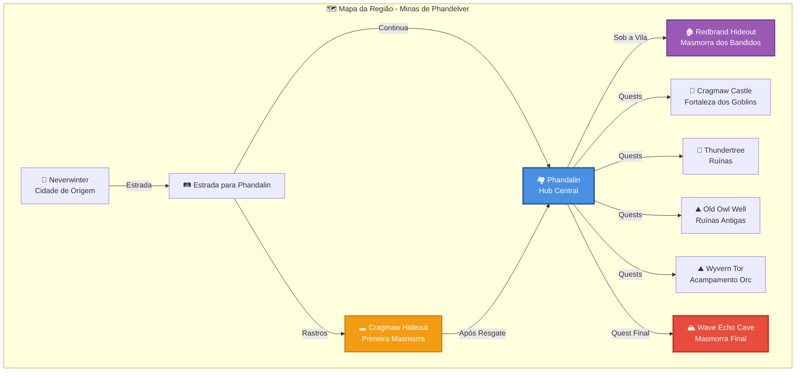

# 6.2. Layouts e Mapas

---

<details open>
<summary style="background-color: #e8e8e8; padding: 4px 8px; border-radius: 4px;"><b>🗺️ Layouts e Mapas</b></summary>

> Esboços 2D (top-down) indicando rotas, posicionamento e eventos.

</details>

---

## Esboços 2D (Top-Down)

- Indicar rotas do jogador
- Posicionamento de inimigos
- Locais de itens e tesouros
- Eventos scriptados
- Pontos de interesse (NPCs, quests)

## Mapas da Campanha

- Seguir mapas oficiais do livro quando disponíveis
- Adaptar para formato top-down 3D
- Manter fidelidade aos layouts originais

## Diagramas Visuais

### Mapa Geral da Região



### Layout Top-Down: Cragmaw Hideout

<details>
<summary style="background-color: #d8d8d8; padding: 3px 6px; border-radius: 3px;">🕳️ Cragmaw Hideout - Primeira Masmorra</summary>

> **Layout Top-Down (ASCII):**
>
> ```
>                    [ENTRADA PRINCIPAL]
>                         │
>                         ▼
>                    ┌─────────┐
>                    │ Área 1  │ ← 2 Goblins (Sentinela)
>                    │ Entrada │
>                    └────┬────┘
>                         │
>                    ┌────▼────┐
>                    │ Área 2  │ ← 3 Goblins + 1 Wolf
>                    │ Cachorro│
>                    └────┬────┘
>                         │
>         ┌────────────────┴────────────────┐
>         │                                 │
>    ┌────▼────┐                      ┌────▼────┐
>    │ Área 3  │                      │ Área 4  │ ← Sildar (Prisioneiro)
>    │ Norte   │                      │ Sul     │
>    │ (Vazio) │                      │ Células │
>    └─────────┘                      └────┬────┘
>                                          │
>                                    ┌─────▼─────┐
>                                    │ Área 5    │ ← Klarg (Bugbear Boss)
>                                    │ Líder     │    + 2 Wolves
>                                    │ Caverna   │
>                                    └───────────┘
> ```
>
> **Elementos:**
>
> - **Entrada:** 2 Goblins de sentinela (emboscada)
> - **Área 2:** Cachorro com 3 Goblins e 1 Wolf
> - **Área 4:** Sildar prisioneiro (objetivo principal)
> - **Área 5:** Klarg (Bugbear) - boss da masmorra
> - **Rotas Alternativas:** Entrada pela cachoeira (se descoberta)
> - **Tesouros:** Escondidos em áreas específicas

</details>

### Layout Top-Down: Phandalin (Hub Central)

<details>
<summary style="background-color: #d8d8d8; padding: 3px 6px; border-radius: 3px;">🏘️ Phandalin - Vila Principal</summary>

> **Layout Top-Down (ASCII):**
>
> ```
>                    ┌─────────────────────────────┐
>                    │        PHANDALIN            │
>                    │                             │
>    ┌───────────────┼───────────────┐            │
>    │   [ESTRADA]   │   [ESTRADA]   │            │
>    │   ENTRADA     │   SAÍDA       │            │
>    └───────┬───────┴───────┬───────┘            │
>            │               │                     │
>    ┌───────▼───────┐ ┌─────▼──────┐             │
>    │ Stonehill Inn │ │ Town Hall  │             │
>    │  (Toblen)     │ │(Harbin)    │             │
>    └───────────────┘ └────────────┘             │
>                                                 │
>    ┌───────────────┐ ┌───────────────┐         │
>    │ Lionshield    │ │ Shrine of     │         │
>    │ Coster        │ │ Luck          │         │
>    │ (Linene)      │ │ (Sister)      │         │
>    └───────────────┘ └───────────────┘         │
>                                                 │
>    ┌───────────────┐ ┌───────────────┐         │
>    │ Edermath      │ │ Alderleaf     │         │
>    │ Orchard       │ │ Farm          │         │
>    │ (Daran)       │ │ (Qelline)     │         │
>    └───────────────┘ └───────────────┘         │
>                                                 │
>                    ┌───────────────┐            │
>                    │ Redbrand      │            │
>                    │ Hideout       │            │
>                    │ (Entrada      │            │
>                    │  Secreta)     │            │
>                    └───────────────┘            │
>                    └─────────────────────────────┘
> ```
>
> **Pontos de Interesse:**
>
> - **Stonehill Inn:** Taverna, informações, descanso
> - **Town Hall:** Prefeito Harbin Wester
> - **Lionshield Coster:** Loja de equipamentos (Linene)
> - **Shrine of Luck:** Sister Garaele (quest giver)
> - **Edermath Orchard:** Daran Edermath (quest giver)
> - **Alderleaf Farm:** Qelline Alderleaf (informações)
> - **Redbrand Hideout:** Entrada secreta sob a vila

</details>

### Layout Top-Down: Redbrand Hideout

<details>
<summary style="background-color: #d8d8d8; padding: 3px 6px; border-radius: 3px;">🏚️ Redbrand Hideout - Masmorra dos Bandidos</summary>

> **Layout Top-Down (ASCII):**
>
> ```
>                    [ENTRADA SECRETA]
>                    (Sob Phandalin)
>                         │
>                         ▼
>                    ┌─────────┐
>                    │ Área 1  │ ← 4 Redbrands
>                    │ Entrada │
>                    └────┬────┘
>                         │
>         ┌────────────────┴────────────────┐
>         │                                 │
>    ┌────▼────┐                      ┌────▼────┐
>    │ Área 2  │                      │ Área 3  │ ← Prisão
>    │ Barracão│                      │ Células │   (Prisioneiros)
>    │         │                      │         │
>    └────┬────┘                      └─────────┘
>         │
>    ┌────▼────┐
>    │ Área 4  │ ← Glasstaff (Iarno)
>    │ Quarto  │   Boss da Masmorra
>    │ Mago    │
>    └─────────┘
> ```
>
> **Elementos:**
>
> - **Entrada Secreta:** Acesso sob Phandalin
> - **Área 1:** 4 Redbrands guardando entrada
> - **Área 2:** Barracão com mais bandidos
> - **Área 3:** Células com prisioneiros
> - **Área 4:** Quarto de Glasstaff (Iarno Albrek) - boss
> - **Objetivo:** Derrotar Glasstaff, libertar prisioneiros

</details>

### Layout Top-Down: Wave Echo Cave (Masmorra Final)

<details>
<summary style="background-color: #d8d8d8; padding: 3px 6px; border-radius: 3px;">🏔️ Wave Echo Cave - Masmorra Final</summary>

> **Layout Top-Down (ASCII):**
>
> ```
>                    [ENTRADA PRINCIPAL]
>                         │
>                         ▼
>                    ┌─────────┐
>                    │ Área 1  │ ← Guardas (Skeletons)
>                    │ Entrada │
>                    └────┬────┘
>                         │
>         ┌────────────────┼────────────────┐
>         │                │                │
>    ┌────▼────┐     ┌────▼────┐     ┌────▼────┐
>    │ Área 2  │     │ Área 3  │     │ Área 4  │
>    │ Norte   │     │ Centro  │     │ Sul     │
>    │ (Mine)  │     │ (Forge) │     │ (Temple)│
>    └─────────┘     └────┬────┘     └─────────┘
>                         │
>                    ┌─────▼─────┐
>                    │ Área 5    │ ← Black Spider (Nezznar)
>                    │ Boss      │   Antagonista Final
>                    │ Chamber   │   + Minions
>                    └───────────┘
> ```
>
> **Elementos:**
>
> - **Área 1:** Entrada guardada por Skeletons
> - **Área 2:** Mina (norte) - recursos e inimigos
> - **Área 3:** Forja (centro) - área importante
> - **Área 4:** Templo (sul) - área sagrada
> - **Área 5:** Câmara do Boss - Nezznar (Black Spider)
> - **Objetivo Final:** Derrotar Nezznar, recuperar a mina

</details>

### Legenda de Símbolos

<details>
<summary style="background-color: #d8d8d8; padding: 3px 6px; border-radius: 3px;">📋 Símbolos e Convenções</summary>

> **Símbolos nos Mapas:**
>
> | Símbolo | Significado |
> |---------|------------|
> | 🏰 | Fortaleza/Castelo |
> | 🏘️ | Vila/Cidade |
> | 🕳️ | Caverna/Masmorra |
> | 🏚️ | Ruínas/Esconderijo |
> | 🏔️ | Montanha/Caverna Grande |
> | 🛤️ | Estrada/Caminho |
> | ⛰️ | Ponto de Referência |
> | 🌲 | Floresta/Área Natural |
> | → | Direção/Fluxo |
> | │ | Conexão Vertical |
> | ─ | Conexão Horizontal |
> | ┌ ┐ └ ┘ | Bordas de Área |
>
> **Cores no Diagrama Mermaid:**
>
> - **Azul:** Hub Central (Phandalin)
> - **Vermelho:** Masmorra Final (Wave Echo Cave)
> - **Laranja:** Masmorras Principais (Cragmaw, Redbrand)
> - **Roxo:** Masmorras Secundárias

</details>

---

## 📝 Changelog

| Versão | Data | Alteração |
|--------|------|-----------|
| v1.0 | 2024-12-27 | Versão inicial - Esboços 2D top-down de todas as áreas da campanha |

**Navegação:** [← Voltar ao Índice](index.md) | [→ Próxima: Ritmo e Fluxo](ritmo-pacing.md)
