# 6.3. Ritmo e Fluxo (Pacing)

---

<b>📈 Ritmo e Fluxo</b>

> Gráfico de tensão vs. tempo e ritmo da campanha. Mapeamento visual da progressão emocional e de dificuldade ao longo de toda a campanha "Minas de Phandelver".

---

## 📊 Gráfico Geral de Tensão vs. Tempo (Campanha Completa)

<b>📈 Visão Geral da Campanha</b>

> Gráfico de tensão ao longo de toda a campanha, mostrando picos de combate, momentos de calmaria e progressão emocional.

### Escala de Tensão

> - **0-2 (Calmaria):** Exploração, diálogos, hubs, compras
> - **3-5 (Tensão Média):** Aproximação de perigo, exploração de masmorras
> - **6-8 (Alta Tensão):** Combates normais, encontros perigosos
> - **9-10 (Clímax):** Boss fights, confrontos finais

### Gráfico Visual (Tensão vs. Tempo)

```mermaid
%%{init: {'theme':'base', 'themeVariables': {'primaryColor':'#4a90e2', 'primaryTextColor':'#fff', 'primaryBorderColor':'#357abd', 'lineColor':'#4a90e2', 'secondaryColor':'#e8e8e8', 'tertiaryColor':'#fff'}}}%%
graph LR
    subgraph "Capítulo 1: Goblin Arrows"
        A[Contrato<br/>Tensão: 1] --> B[Ataque Goblin<br/>Tensão: 7]
        B --> C[Cragmaw Hideout<br/>Tensão: 8]
        C --> D[Resgate Sildar<br/>Tensão: 2]
    end

    subgraph "Capítulo 2: Phandalin"
        D --> E[Chegada Phandalin<br/>Tensão: 2]
        E --> F[Exploração Vila<br/>Tensão: 3]
        F --> G[Redbrand Hideout<br/>Tensão: 8]
        G --> H[Thundertree Opcional<br/>Tensão: 9]
        H --> I[Descanso Phandalin<br/>Tensão: 1]
    end

    subgraph "Capítulo 3: Spider's Web"
        I --> J[Cragmaw Castle<br/>Tensão: 8]
        J --> K[Resgate Gundren<br/>Tensão: 2]
    end

    subgraph "Capítulo 4: Wave Echo Cave"
        K --> L[Entrada Caverna<br/>Tensão: 6]
        L --> M[Área Mortos-Vivos<br/>Tensão: 7]
        M --> N[Nothic<br/>Tensão: 7]
        N --> O[Black Spider<br/>Tensão: 10]
        O --> P[Forja das Magias<br/>Tensão: 1]
    end

    style A fill:#90EE90
    style B fill:#FFA500
    style C fill:#FF6347
    style D fill:#90EE90
    style E fill:#90EE90
    style F fill:#FFD700
    style G fill:#FF6347
    style H fill:#FF0000
    style I fill:#90EE90
    style J fill:#FF6347
    style K fill:#90EE90
    style L fill:#FFA500
    style M fill:#FF6347
    style N fill:#FF6347
    style O fill:#8B0000
    style P fill:#90EE90
```

> **Legenda de Cores:**
>
> - 🟢 **Verde (Tensão 0-2):** Calmaria, exploração, diálogos
> - 🟡 **Amarelo (Tensão 3-5):** Tensão crescente, exploração perigosa
> - 🟠 **Laranja (Tensão 6-7):** Combates normais, encontros perigosos
> - 🔴 **Vermelho (Tensão 8-9):** Boss fights, encontros muito difíceis
> - ⚫ **Vermelho Escuro (Tensão 10):** Clímax máximo, confronto final

---

## 📈 Gráficos Detalhados por Capítulo

📖 Capítulo 1: Goblin Arrows

> **Duração Estimada:** 2-3 horas
>
> **Progressão de Tensão:**
>
> | Momento | Tensão | Tipo | Descrição |
> |---------|--------|------|-----------|
> | Contrato Inicial | 1 | Calmaria | Recebimento da missão, diálogo |
> | Viagem para Phandalin | 2 | Calmaria | Exploração da estrada |
> | Ataque Goblin | 7 | Combate | Primeiro combate, emboscada |
> | Investigação Rastros | 3 | Tensão Crescente | Decisão: seguir ou continuar |
> | Cragmaw Hideout | 8 | Boss Fight | Klarg (Bugbear), primeira masmorra |
> | Resgate Sildar | 2 | Resolução | Diálogo, informações, level up |
>
> **Padrão de Ritmo:**
>
> - **Início suave** (contrato) → **Pico inicial** (ataque) → **Clímax** (hideout) → **Resolução** (resgate)
> - Alternância clara entre calmaria e tensão
> - Primeiro boss fight serve como introdução ao sistema de combate

🏘️ Capítulo 2: Phandalin

> **Duração Estimada:** 3-4 horas
>
> **Progressão de Tensão:**
>
> | Momento | Tensão | Tipo | Descrição |
> |---------|--------|------|-----------|
> | Chegada Phandalin | 2 | Calmaria | Entrega de suprimentos, exploração |
> | Exploração da Vila | 3 | Tensão Crescente | Descobrimento de problemas, quests |
> | Quest Redbrands | 4 | Tensão Crescente | Aproximação da mansão |
> | Redbrand Hideout | 8 | Boss Fight | Iarno "Cajavidro", masmorra |
> | Thundertree (Opcional) | 9 | Boss Fight | Venomfang (Dragão Verde) |
> | Descanso em Phandalin | 1 | Calmaria | Preparação, compras, level up |
>
> **Padrão de Ritmo:**
>
> - **Hub central** com múltiplas quests disponíveis
> - **Tensão crescente** conforme jogadores exploram
> - **Pico opcional** (Venomfang) para jogadores que buscam desafio
> - **Momentos de descanso** entre combates intensos

🕷️ Capítulo 3: The Spider's Web

> **Duração Estimada:** 2-3 horas
>
> **Progressão de Tensão:**
>
> | Momento | Tensão | Tipo | Descrição |
> |---------|--------|------|-----------|
> | Preparação | 2 | Calmaria | Planejamento, preparação |
> | Viagem para Castle | 3 | Tensão Crescente | Aproximação da fortaleza |
> | Cragmaw Castle | 8 | Boss Fight | King Grol, resgate de Gundren |
> | Resgate Gundren | 2 | Resolução | Diálogo, mapa da mina, level up |
>
> **Padrão de Ritmo:**
>
> - **Foco narrativo** no resgate de Gundren
> - **Tensão crescente** até o confronto final do capítulo
> - **Resolução satisfatória** com progressão narrativa importante

🏔️ Capítulo 4: Wave Echo Cave

> **Duração Estimada:** 4-5 horas
>
> **Progressão de Tensão:**
>
> | Momento | Tensão | Tipo | Descrição |
> |---------|--------|------|-----------|
> | Preparação Final | 2 | Calmaria | Última preparação, planejamento |
> | Entrada da Caverna | 6 | Combate | Primeiros encontros |
> | Área Mortos-Vivos | 7 | Combate | Zombies, Ghouls, Flameskull |
> | Área Nothic | 7 | Encontro Especial | Negociação ou combate |
> | Aproximação Black Spider | 8 | Tensão Crescente | Preparação para confronto final |
> | Black Spider (Boss Final) | 10 | Clímax | Nezznar, confronto final |
> | Forja das Magias | 1 | Resolução Final | Recompensas, conclusão |
>
> **Padrão de Ritmo:**
>
> - **Tensão crescente constante** ao longo da masmorra
> - **Múltiplos picos** antes do clímax
> - **Clímax máximo** no confronto final
> - **Resolução satisfatória** com recompensas finais

---

## 🎯 Princípios de Ritmo Aplicados

📐 Regras de Design de Ritmo

> **1. Alternância Calmaria-Tensão:**
>
> - Cada pico de tensão é seguido por momento de calmaria
> - Permite jogadores processarem eventos e se prepararem
> - Evita fadiga emocional
>
> **2. Crescimento Progressivo:**
>
> - Tensão aumenta gradualmente ao longo da campanha
> - Cada capítulo tem pico maior que o anterior
> - Clímax final (Black Spider) é o pico máximo
>
> **3. Variação de Intensidade:**
>
> - Nem todos os combates são igualmente intensos
> - Combates menores (tensão 6-7) alternam com bosses (tensão 8-10)
> - Exploração e diálogos (tensão 1-3) quebram ritmo de combate
>
> **4. Momentos de Descanso:**
>
> - Phandalin serve como hub de descanso
> - Jogadores podem retornar entre quests
> - Permite preparação e planejamento
>
> **5. Picos Opcionais:**
>
> - Venomfang (tensão 9) é opcional
> - Permite jogadores escolherem nível de desafio
> - Não bloqueia progressão principal

---

## 📊 Tabela de Referência Rápida

📋 Todos os Encontros por Tensão

> | Encontro | Capítulo | Tensão | Tipo |
> |----------|----------|--------|------|
> | Contrato Inicial | 1 | 1 | Calmaria |
> | Ataque Goblin | 1 | 7 | Combate |
> | Cragmaw Hideout | 1 | 8 | Boss Fight |
> | Chegada Phandalin | 2 | 2 | Calmaria |
> | Exploração Vila | 2 | 3 | Tensão Crescente |
> | Redbrand Hideout | 2 | 8 | Boss Fight |
> | Thundertree (Opcional) | 2 | 9 | Boss Fight |
> | Cragmaw Castle | 3 | 8 | Boss Fight |
> | Entrada Wave Echo Cave | 4 | 6 | Combate |
> | Área Mortos-Vivos | 4 | 7 | Combate |
> | Nothic | 4 | 7 | Encontro Especial |
> | Black Spider | 4 | 10 | Clímax Final |
> | Forja das Magias | 4 | 1 | Resolução |

---

## 🎮 Aplicação no Gameplay

⚙️ Como Usar Este Gráfico

> **Para Designers:**
>
> - Use para balancear dificuldade ao longo da campanha
> - Garanta que não há picos consecutivos muito altos
> - Verifique que momentos de descanso são suficientes
>
> **Para Level Designers:**
>
> - Posicione encontros de acordo com curva de tensão
> - Use momentos de calmaria para exploração e descoberta
> - Prepare áreas de descanso em hubs
>
> **Para Programadores:**
>
> - Implemente sistema de música dinâmica baseado em tensão
> - Ajuste iluminação e atmosfera conforme nível de tensão
> - Considere sistema de "tensão" como variável de gameplay
>
> **Para Testadores:**
>
> - Verifique se ritmo está sendo respeitado
> - Teste se momentos de descanso são suficientes
> - Valide se picos de tensão são satisfatórios

---

## 📝 Changelog

| Versão | Data | Alteração |
|--------|------|-----------|
| v1.0 | 2024-12-27 | Versão inicial - Gráficos de tensão vs. tempo para campanha completa |

**Navegação:** [← Voltar ao Índice](index.md) | [→ Próxima Seção: UI/UX](../07-ui-ux/index.md)
