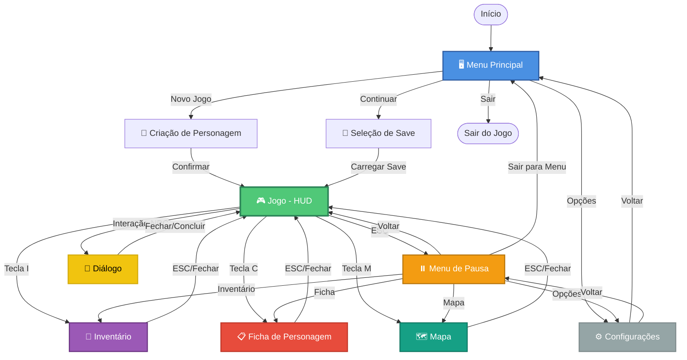

# 7.2. Fluxo de Navegação (Screen Flow)

---

<details open>
<summary style="background-color: #e8e8e8; padding: 4px 8px; border-radius: 4px;"><b>🔄 Fluxo de Navegação</b></summary>

> Diagrama mostrando como o jogador transita entre telas.

</details>

---

## Diagrama de Navegação

```
Menu Principal
   ↓
[Novo Jogo] → Criação de Personagem → Jogo
[Continuar] → Seleção de Save → Jogo
[Opções] → Configurações → Voltar
[Sair] → Confirmação → Sair
```

## Durante o Jogo

```
Jogo (HUD)
   ↓
[ESC] → Menu de Pausa (pausa o jogo)
[Tecla I] → Inventário (overlay, não pausa)
[Tecla C] → Ficha de Personagem (overlay, não pausa)
[Tecla M] → Mapa (overlay, não pausa)
[Interação NPC] → Diálogo (pausa o jogo)
```

### Comportamento das Telas

- **Menu de Pausa:** Pausa o jogo completamente
- **Inventário/Ficha/Mapa:** Overlay (jogo continua em background, mas não interativo)
- **Diálogo:** Pausa o jogo durante conversa
- **Configurações:** Sempre acessível, retorna ao menu de origem

## Diagrama Visual



### Fluxo Detalhado por Contexto

<details>
<summary style="background-color: #d8d8d8; padding: 3px 6px; border-radius: 3px;">🖥️ Menu Principal → Jogo</summary>

> **Fluxo Inicial:**
>
> 1. **Menu Principal** → Seleciona "Novo Jogo" ou "Continuar"
> 2. **Novo Jogo** → **Criação de Personagem** (Raça, Classe, Atributos, Background)
> 3. **Continuar** → **Seleção de Save** (Lista de saves disponíveis)
> 4. Após criação/carregamento → **Jogo (HUD)** inicia

</details>

<details>
<summary style="background-color: #d8d8d8; padding: 3px 6px; border-radius: 3px;">🎮 Durante o Jogo</summary>

> **Acesso aos Menus:**
>
> - **ESC** → Abre **Menu de Pausa** (pausa o jogo)
> - **Tecla I** → Abre **Inventário** (não pausa, overlay)
> - **Tecla C** → Abre **Ficha de Personagem** (não pausa, overlay)
> - **Tecla M** → Abre **Mapa** (não pausa, overlay)
> - **Interação com NPC** → Abre **Diálogo** (pausa o jogo)
>
> **Nota:** Inventário, Ficha e Mapa podem ser acessados também pelo Menu de Pausa.

</details>

<details>
<summary style="background-color: #d8d8d8; padding: 3px 6px; border-radius: 3px;">⏸️ Menu de Pausa</summary>

> **Opções Disponíveis:**
>
> - **Inventário** → Abre menu de inventário
> - **Ficha** → Abre ficha de personagem
> - **Mapa** → Abre mapa do mundo
> - **Opções** → Abre configurações (Áudio, Gráficos, Controles)
> - **Voltar** → Retorna ao jogo
> - **Sair para Menu** → Volta ao Menu Principal (com confirmação)

</details>

<details>
<summary style="background-color: #d8d8d8; padding: 3px 6px; border-radius: 3px;">⚙️ Configurações</summary>

> **Acesso:**
>
> - Pode ser acessado do **Menu Principal** ou do **Menu de Pausa**
> - Sempre retorna ao menu de origem (Menu Principal ou Pausa)
>
> **Opções:**
>
> - **Áudio:** Volume geral, música, SFX
> - **Gráficos:** Resolução, qualidade, fullscreen
> - **Controles:** Mapeamento de teclas, sensibilidade

</details>

---

## ⌨️ Atalhos de Teclado

<details>
<summary style="background-color: #d8d8d8; padding: 3px 6px; border-radius: 3px;">📋 Mapeamento Completo</summary>

> **Durante o Jogo (HUD):**
>
> | Tecla | Ação | Comportamento |
> |-------|------|--------------|
> | **ESC** | Menu de Pausa | Pausa o jogo |
> | **I** | Inventário | Overlay (jogo continua) |
> | **C** | Ficha de Personagem | Overlay (jogo continua) |
> | **M** | Mapa | Overlay (jogo continua) |
> | **E** | Interagir | Abre diálogo/coleta item |
> | **Tab** | Alternar HUD | Mostra/esconde elementos |
> | **1-0** | Hotbar | Usa habilidade/item |
>
> **Em Menus:**
>
> | Tecla | Ação | Comportamento |
> |-------|------|--------------|
> | **ESC** | Fechar/Voltar | Fecha menu atual |
> | **Enter** | Confirmar | Confirma seleção |
> | **Setas** | Navegar | Move entre opções |
> | **Tab** | Próximo Campo | Próximo campo de formulário |

</details>

---

## 🔄 Regras de Navegação

<details>
<summary style="background-color: #d8d8d8; padding: 3px 6px; border-radius: 3px;">📐 Princípios de Design</summary>

> **1. Consistência:**
>
> - ESC sempre fecha/volta (exceto em confirmações críticas)
> - Enter sempre confirma
> - Setas sempre navegam
>
> **2. Feedback Visual:**
>
> - Transições suaves entre telas
> - Indicadores visuais de tela ativa
> - Destaque para opção selecionada
>
> **3. Acessibilidade:**
>
> - Todos os menus acessíveis por teclado
> - Suporte a mouse (quando aplicável)
> - Tooltips explicativos
>
> **4. Performance:**
>
> - Menus overlay não bloqueiam gameplay
> - Carregamento rápido entre telas
> - Animações leves e responsivas

</details>

---

## 📝 Changelog

| Versão | Data | Alteração |
|--------|------|-----------|
| v1.0 | 2024-12-27 | Versão inicial - Diagrama completo de navegação entre telas |

**Navegação:** [← Voltar ao Índice](index.md) | [→ Próxima: Feedback Visual](feedback-visual.md)
