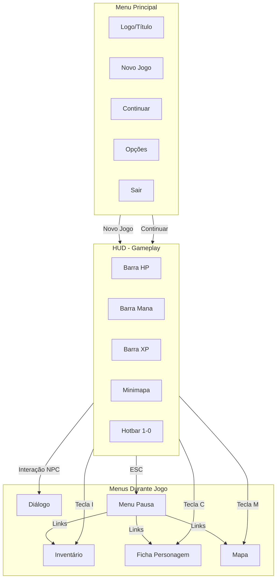

# 7.1. Wireframes

---

<details open>
<summary style="background-color: #e8e8e8; padding: 4px 8px; border-radius: 4px;"><b>📐 Wireframes</b></summary>

> Esboços de baixa fidelidade de todas as telas principais do jogo.

</details>

---

<details>
<summary style="background-color: #fff3cd; padding: 4px 8px; border-radius: 4px;"><b>⚠️ Status: Layout Pendente de Alterações</b></summary>

> **Nota Importante:** Os layouts apresentados nesta seção são versões iniciais e estão **pendentes de alterações e reorganizações**.
>
> - Layouts podem ser ajustados durante desenvolvimento
> - Posicionamento de elementos sujeito a mudanças
> - Organização visual pode ser refinada após testes de usabilidade
> - Wireframes serão atualizados conforme feedback e iterações
>

</details>

---

## Telas Principais

<details>
<summary style="background-color: #d8d8d8; padding: 3px 6px; border-radius: 3px;">🖥️ Menu Principal</summary>

> Tela inicial do jogo com opções principais.

```
┌─────────────────────────────────────────┐
│                                         │
│         [LOGO DO JOGO]                  │
│      Minas de Phandelver                │
│                                         │
│                                         │
│         [NOVO JOGO]                     │
│         [CONTINUAR]                    │
│         [OPÇÕES]                       │
│         [SAIR]                          │
│                                         │
│                                         │
└─────────────────────────────────────────┘
```

**Elementos:**

- Logo/Título centralizado
- Botões principais (Novo Jogo, Continuar, Opções, Sair)
- Fundo temático da campanha

</details>

<details>
<summary style="background-color: #d8d8d8; padding: 3px 6px; border-radius: 3px;">🎮 HUD (Heads-Up Display)</summary>

> Interface durante o gameplay, sempre visível.

```
┌─────────────────────────────────────────────────────────┐
│ [HP: ████████░░] [Mana: ████░░░░] [XP: ████████░░]     │
│  45/50         12/20         850/1000                   │
│                                                          │
│  ┌──────────┐                                           │
│  │ Minimapa │                                           │
│  │    🗺️    │                                           │
│  │          │                                           │
│  └──────────┘                                           │
│                                                          │
│                                                          │
│  [1] [2] [3] [4] [5] [6] [7] [8] [9] [0]              │
│  ⚔️  🔮  🛡️  💊  🔍  📜  🗺️  ⚙️  💬  🎒              │
│                                                          │
│  [Ataque] [Magia] [Defesa] [Poção] [Explorar]          │
│  [Quest]  [Mapa]  [Opções] [Diálogo] [Inventário]      │
└─────────────────────────────────────────────────────────┘
```

**Elementos:**

- **Barra de HP:** Canto superior esquerdo, visual de barra
- **Barra de Mana/Spell Slots:** Ao lado do HP
- **Barra de XP:** Mostra progresso para próximo nível
- **Minimapa:** Canto superior direito, mostra área atual
- **Hotbar:** Inferior, 10 slots (1-0) com habilidades/items
- **Tooltips:** Aparecem ao passar mouse sobre elementos

</details>

<details>
<summary style="background-color: #d8d8d8; padding: 3px 6px; border-radius: 3px;">🎒 Inventário</summary>

> Gerenciamento de itens e equipamentos.

```
┌─────────────────────────────────────────────────────────┐
│  INVENTÁRIO                                    [X Fechar]│
├─────────────────────────────────────────────────────────┤
│                                                          │
│  EQUIPAMENTO:                                           │
│  ┌────┐  ┌────┐  ┌────┐  ┌────┐                        │
│  │    │  │    │  │    │  │    │                        │
│  │Cabe│  │Peit│  │Mãos│  │Pés │                        │
│  └────┘  └────┘  └────┘  └────┘                        │
│                                                          │
│  ┌────┐  ┌────┐                                        │
│  │    │  │    │                                        │
│  │Mão1│  │Mão2│                                        │
│  └────┘  └────┘                                        │
│                                                          │
│  ITENS:                                                  │
│  ┌────┐ ┌────┐ ┌────┐ ┌────┐ ┌────┐                   │
│  │Esp │ │Arco│ │Fle │ │Poç │ │Gem │                   │
│  │ada │ │    │ │cha │ │Hp  │ │a   │                   │
│  └────┘ └────┘ └────┘ └────┘ └────┘                   │
│                                                          │
│  ┌────┐ ┌────┐ ┌────┐ ┌────┐ ┌────┐                   │
│  │    │ │    │ │    │ │    │ │    │                   │
│  └────┘ └────┘ └────┘ └────┘ └────┘                   │
│                                                          │
│  [Peso: 45/100]  [Moedas: 250 GP]                       │
└─────────────────────────────────────────────────────────┘
```

**Elementos:**

- **Slots de Equipamento:** Cabeça, Peito, Mãos, Pés, Mão Principal, Mão Secundária
- **Grid de Itens:** 5x4 (20 slots) com scroll se necessário
- **Informações:** Peso atual/máximo, moedas
- **Tooltip:** Aparece ao passar mouse sobre item

</details>

<details>
<summary style="background-color: #d8d8d8; padding: 3px 6px; border-radius: 3px;">📋 Ficha de Personagem</summary>

> Estatísticas completas do personagem (D&D 5e).

```
┌─────────────────────────────────────────────────────────┐
│  FICHA DE PERSONAGEM                         [X Fechar] │
├─────────────────────────────────────────────────────────┤
│                                                          │
│  Nome: [Aragorn]  Nível: [3]  Classe: [Fighter]         │
│  Raça: [Humano]  Background: [Soldier]                    │
│                                                          │
│  ATRIBUTOS:                                              │
│  ┌──────┬──────┬──────┬──────┬──────┬──────┐           │
│  │  FOR │  DES │  CON │  INT │  SAB │  CAR │           │
│  │  16  │  14  │  15  │  10  │  12  │  13  │           │
│  │ (+3) │ (+2) │ (+2) │ (+0) │ (+1) │ (+1) │           │
│  └──────┴──────┴──────┴──────┴──────┴──────┘           │
│                                                          │
│  HP: [45/50]  AC: [18]  Prof Bonus: [+2]               │
│                                                          │
│  SKILLS:                                                 │
│  ✅ Atletismo (FOR)    ✅ Percepção (SAB)                │
│  ✅ Intimidação (CAR)  ⬜ Acrobacia (DES)                │
│  ⬜ Furtividade (DES)  ⬜ Arcanismo (INT)                │
│  ...                                                    │
│                                                          │
│  FEATURES:                                               │
│  • Second Wind (1x/rest)                                │
│  • Action Surge (1x/rest)                               │
│  • Fighting Style: Defense                              │
│                                                          │
│  [Abas: Atributos | Skills | Features | Spells]         │
└─────────────────────────────────────────────────────────┘
```

**Elementos:**

- **Informações Básicas:** Nome, nível, classe, raça
- **Atributos:** 6 atributos com valores e modificadores
- **HP/AC:** Pontos de vida e Armor Class
- **Skills:** Lista de skills com proficiência marcada
- **Features:** Habilidades de classe e raça
- **Abas:** Para organizar informações (Spells, etc.)

</details>

<details>
<summary style="background-color: #d8d8d8; padding: 3px 6px; border-radius: 3px;">💬 Menu de Diálogo</summary>

> Sistema de diálogos com NPCs.

```
┌─────────────────────────────────────────────────────────┐
│                                                          │
│                                                          │
│                                                          │
│  ┌──────────────────────────────────────────────┐      │
│  │ [Avatar NPC]                                  │      │
│  │                                                │      │
│  │  Gundren Busca-Rocha:                         │      │
│  │  "Obrigado por me salvar! A mina está em     │      │
│  │   perigo, precisamos agir rápido."           │      │
│  │                                                │      │
│  └──────────────────────────────────────────────┘      │
│                                                          │
│  OPÇÕES:                                                │
│  ┌──────────────────────────────────────────────┐      │
│  │ [1] "Conte-me mais sobre a mina."             │      │
│  └──────────────────────────────────────────────┘      │
│  ┌──────────────────────────────────────────────┐      │
│  │ [2] "Onde está o Black Spider?"              │      │
│  └──────────────────────────────────────────────┘      │
│  ┌──────────────────────────────────────────────┐      │
│  │ [3] "Preciso de informações sobre Phandalin."│      │
│  └──────────────────────────────────────────────┘      │
│  ┌──────────────────────────────────────────────┐      │
│  │ [4] "Adeus."                                  │      │
│  └──────────────────────────────────────────────┘      │
│                                                          │
└─────────────────────────────────────────────────────────┘
```

**Elementos:**

- **Avatar/Imagem do NPC:** Lado esquerdo ou central
- **Caixa de Texto:** Diálogo atual do NPC
- **Opções de Resposta:** 2-4 opções numeradas (1-4)
- **Navegação:** Teclas numéricas ou mouse para selecionar

</details>

<details>
<summary style="background-color: #d8d8d8; padding: 3px 6px; border-radius: 3px;">🗺️ Mapa</summary>

> Mapa do mundo com localizações e quests.

```
┌─────────────────────────────────────────────────────────┐
│  MAPA                                          [X Fechar]│
├─────────────────────────────────────────────────────────┤
│                                                          │
│  ┌──────────────────────────────────────────────┐      │
│  │                                                │      │
│  │         [Phandalin]                           │      │
│  │            🏘️                                 │      │
│  │                                                │      │
│  │    [Cragmaw]      [Thundertree]               │      │
│  │      🏰              🏚️                       │      │
│  │                                                │      │
│  │                                                │      │
│  │         [Wave Echo]                           │      │
│  │            🏔️                                 │      │
│  │                                                │      │
│  └──────────────────────────────────────────────┘      │
│                                                          │
│  LEGENDA:                                               │
│  🏘️ Vila        🏰 Fortaleza    🏚️ Ruínas             │
│  🏔️ Masmorra    ⭐ Quest Ativa  📍 Localização Atual   │
│                                                          │
│  [Filtrar: Todas | Quests | Locais | NPCs]              │
└─────────────────────────────────────────────────────────┘
```

**Elementos:**

- **Mapa Visual:** Área central com localizações
- **Marcadores:** Ícones para diferentes tipos de locais
- **Quest Markers:** Marcadores de quests ativas
- **Localização Atual:** Indicador do jogador
- **Legenda:** Explicação dos ícones
- **Filtros:** Opções para filtrar o que aparece no mapa

</details>

<details>
<summary style="background-color: #d8d8d8; padding: 3px 6px; border-radius: 3px;">⚙️ Menu de Opções/Pausa</summary>

> Menu de pausa com opções e configurações.

```
┌─────────────────────────────────────────────────────────┐
│  MENU DE PAUSA                                [ESC Voltar]│
├─────────────────────────────────────────────────────────┤
│                                                          │
│  ┌──────────────────────────────────────────────┐      │
│  │ [INVENTÁRIO]                                  │      │
│  └──────────────────────────────────────────────┘      │
│  ┌──────────────────────────────────────────────┐      │
│  │ [FICHA DE PERSONAGEM]                        │      │
│  └──────────────────────────────────────────────┘      │
│  ┌──────────────────────────────────────────────┐      │
│  │ [MAPA]                                        │      │
│  └──────────────────────────────────────────────┘      │
│  ┌──────────────────────────────────────────────┐      │
│  │ [QUESTS]                                      │      │
│  └──────────────────────────────────────────────┘      │
│  ┌──────────────────────────────────────────────┐      │
│  │ [OPÇÕES]                                      │      │
│  │   - Áudio                                     │      │
│  │   - Gráficos                                  │      │
│  │   - Controles                                 │      │
│  └──────────────────────────────────────────────┘      │
│  ┌──────────────────────────────────────────────┐      │
│  │ [SAIR PARA MENU PRINCIPAL]                    │      │
│  └──────────────────────────────────────────────┘      │
│                                                          │
└─────────────────────────────────────────────────────────┘
```

**Elementos:**

- **Acesso Rápido:** Links para Inventário, Ficha, Mapa
- **Quests:** Lista de quests ativas
- **Opções:** Configurações de áudio, gráficos, controles
- **Sair:** Voltar ao menu principal

</details>

---

## Estrutura Visual com Mermaid



---

## Especificações de Layout

### Resolução Base

- **1920x1080** (Full HD) como referência
- Interface responsiva para diferentes resoluções

### Elementos de UI Comuns

- **Fontes:** Legíveis, estilo medieval/fantasia
- **Cores:** Tema D&D (tons terrosos, dourado, vermelho para HP)
- **Ícones:** Estilo consistente, reconhecíveis
- **Tooltips:** Aparecem ao passar mouse, informativos

### Navegação por Teclado

- **ESC:** Abre/fecha menus
- **I:** Inventário
- **C:** Ficha de Personagem
- **M:** Mapa
- **1-0:** Hotbar (habilidades/itens)
- **E:** Interagir (NPCs, objetos)
- **Tab:** Alternar entre elementos do HUD

---

## 📝 Changelog

| Versão | Data | Alteração |
|--------|------|-----------|
| v1.0 | 2024-12-27 | Versão inicial - Wireframes de baixa fidelidade para todas as telas principais |

**Navegação:** [← Voltar ao Índice](index.md) | [→ Próxima: Fluxo de Navegação](fluxo-navegacao.md)
