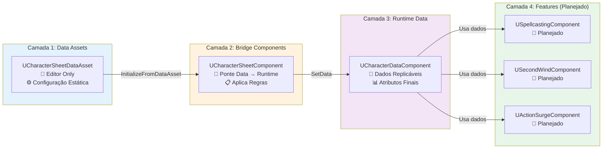

# Arquitetura em Camadas

---

## 📝 Changelog

| Versão | Data | Alteração |
|--------|------|-----------|
| v1.0 | 2024-12-27 | Índice criado após divisão de architecture.md |

---

<b>📐 Visão Geral</b>

> A arquitetura do projeto é organizada em **4 camadas** distintas, cada uma com responsabilidade única e bem definida:
>
> 1. **Camada 1: Data Assets** (Editor/Configuração) - Armazena configuração estática
> 2. **Camada 2: Bridge Components** (Aplicação de Regras) - Ponte entre Data Asset e Runtime
> 3. **Camada 3: Runtime Data Components** (Dados Replicáveis) - Armazena dados em runtime
> 4. **Camada 4: Feature Components** (Lógica Específica) - Gerencia features específicas

---

## 📖 Camadas

- **[Camada 1: Data Assets](layer-1-data-assets.md)** - Editor/Configuração
- **[Camada 2: Bridge Components](layer-2-bridge-components.md)** - Aplicação de Regras
- **[Camada 3: Runtime Data Components](layer-3-runtime-data.md)** - Dados Replicáveis
- **[Camada 4: Feature Components](layer-4-feature-components.md)** - Lógica Específica

---

## 📊 Diagrama Visual das Camadas

---

**Navegação:** [← Voltar para Arquitetura](../index.md) | [→ Princípios](../principios/index.md)

**Última atualização:** 2024-12-27
