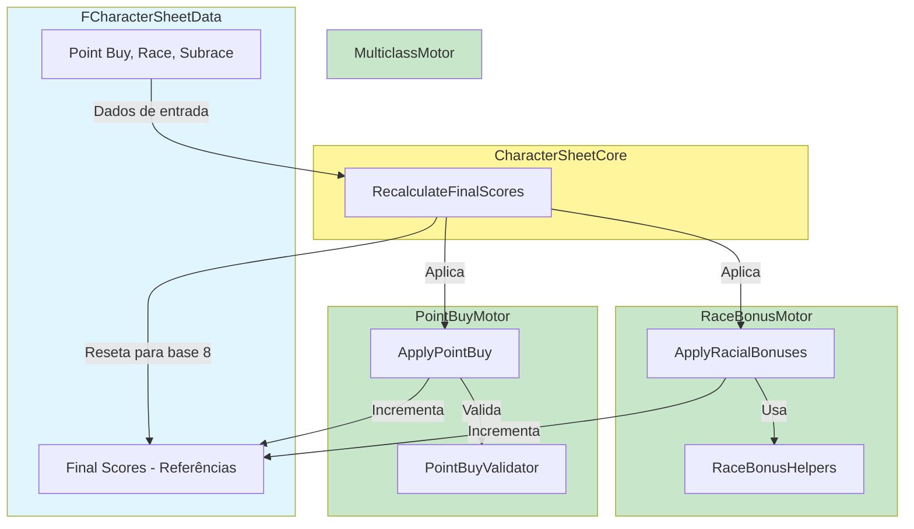

# Arquitetura CreateSheet/

---

## 📝 Changelog

| Versão | Data | Alteração |
|--------|------|-----------|
| v1.0 | 2024-12-27 | Extraído de architecture.md |

---

## ⚙️ Motores Desacoplados para Criação de Personagem

O sistema utiliza uma arquitetura modular com motores desacoplados para cálculo de ability scores finais. Esta arquitetura permite reutilização em diferentes contextos (Data Asset, Widgets) e facilita testes e manutenção.

---

## Motores

### FCharacterSheetCore - Orquestrador

**Localização:** `Source/MyProject2/CreateSheet/Core/CharacterSheetCore.h`

**Responsabilidade:** Orquestrar todos os motores de criação de personagem de forma genérica.

**Características:**

- Função estática `RecalculateFinalScores()` que coordena todos os motores
- Recebe `FCharacterSheetData` (estrutura genérica) ao invés de objetos concretos
- Reseta scores para base (8) e aplica cada motor sequencialmente
- Funciona tanto no Data Asset quanto em Widgets

**Fórmula de Cálculo:**

```
FinalScore = 8 (base) + RacialBonus + PointBuyAllocation
```

**Fluxo:**

1. Reseta todos os Final Scores para 8 (base)
2. Aplica `FRaceBonusMotor::ApplyRacialBonuses()`
3. Aplica `FPointBuyMotor::ApplyPointBuy()`

### FMulticlassMotor - Motor de Multiclassing

**Localização:** `Source/MyProject2/CreateSheet/Multiclass/MulticlassMotor.h`

**Responsabilidade:** Validar e aplicar regras de multiclassing D&D 5e.

**Características:**

- Motor independente: não conhece outros motores, apenas aplica regras de multiclasse
- Genérico: recebe dados puros (`FCharacterSheetData`), não objetos concretos
- Valida requisitos de atributo para multiclassing D&D 5e (`GetAvailableClasses()`)
- Suporte para requisitos complexos (ex: "STR/13|DEX/13" - STR ou DEX >= 13)
- Processa mudanças de nível em classes específicas (`ProcessLevelChange()`)
- Busca informações de classe diretamente na ClassDataTable

**Funções Principais:**

- `GetAvailableClasses()` - Retorna classes disponíveis baseado em requisitos de atributo
- `ValidateMulticlassRequirements()` - Valida se personagem atende requisitos para nova classe
- `ProcessLevelChange()` - Processa mudança de nível e loga features ganhas

### 🔮 FChoiceMotor - Motor de Escolhas de Classe (Planejado)

**Status:** 🔮 Planejado para implementação futura

**Localização Planejada:** `Source/MyProject2/CreateSheet/Choices/ChoiceMotor.h`

**Responsabilidade Planejada:** Processar escolhas de classe (subclasses, fighting styles, etc.) baseadas em `FClassFeatureChoice` do DataTable.

**Nota:** Atualmente, escolhas são gerenciadas por handlers/validators. Um motor dedicado pode ser criado no futuro se necessário.

### FCharacterSheetData - Estrutura Genérica

**Localização:** `Source/MyProject2/CreateSheet/Core/CharacterSheetData.h`

**Responsabilidade:** Estrutura genérica de dados que permite o Core funcionar em diferentes contextos.

**Características:**

- Struct C++ normal (não USTRUCT) - contém ponteiros e não precisa ser exposta ao Blueprint
- Contém dados de entrada (Point Buy, Race, Subrace, Custom Choices)
- Contém referências de saída (ponteiros para Final Scores)
- Permite reutilização: mesmo Core funciona no Data Asset e em Widgets

**Princípio:** "Program to an interface, not an implementation" (Design Patterns)

### FRaceBonusMotor - Motor de Bônus Raciais

**Localização:** `Source/MyProject2/CreateSheet/RaceBonus/RaceBonusMotor.h`

**Responsabilidade:** Calcular e aplicar bônus raciais nos Final Scores.

**Características:**

- Motor independente: não conhece Point Buy, apenas aplica bônus raciais
- Recebe `FCharacterSheetData` (dados puros), não objetos concretos
- Usa `FRaceBonusHelpers` para cálculos puros
- Suporta Variant Human com escolhas customizadas

**Fluxo:**

1. Busca RaceRow e SubraceRow usando `DataTableHelpers`
2. Calcula bônus usando `FRaceBonusHelpers::CalculateRacialBonuses()`
3. Incrementa Final Scores usando `FRaceBonusHelpers::IncrementFinalScoresWithRacialBonuses()`

### FPointBuyMotor - Motor de Point Buy

**Localização:** `Source/MyProject2/CreateSheet/PointBuy/PointBuyMotor.h`

**Responsabilidade:** Aplicar alocação de Point Buy nos Final Scores com validação automática.

**Características:**

- Motor independente: não conhece bônus raciais, apenas aplica Point Buy
- Valida automaticamente se não excede 27 pontos
- Ajusta automaticamente se exceder (reduz do final da fila)
- Retorna `FPointBuyResult` com feedback para o caller ajustar a UI

**Fluxo:**

1. Converte dados de entrada para `TMap<FName, int32>`
2. Calcula custo total usando `CharacterSheetHelpers::CalculateTotalPointBuyCost()`
3. Se exceder 27 pontos, ajusta usando `AdjustPointBuyAllocation()`
4. Incrementa Final Scores usando `CalculationHelpers::IncrementFinalScoresWithPointBuy()`
5. Retorna `FPointBuyResult` com feedback

---

## Princípio Fundamental

Motores são completamente desacoplados e não conhecem uns aos outros.

- ✅ `FRaceBonusMotor` não conhece `FPointBuyMotor`
- ✅ `FPointBuyMotor` não conhece `FRaceBonusMotor`
- ✅ `FMulticlassMotor` não conhece outros motores
- ✅ `FChoiceMotor` não conhece outros motores
- ✅ Ambos apenas incrementam Final Scores (não resetam)
- ✅ `FCharacterSheetCore` é responsável por resetar e orquestrar

**Benefícios:**

- ✅ Fácil testar cada motor isoladamente
- ✅ Fácil adicionar novos motores (ex: LevelUpMotor, FeatMotor)
- ✅ Fácil modificar ordem de aplicação
- ✅ Reutilização em diferentes contextos

### Diagrama de Arquitetura



**📖 Para mais detalhes sobre a implementação, veja os arquivos em `Source/MyProject2/CreateSheet/`**

---

**Navegação:** [← Fluxo de Dados](fluxo-dados.md) | [→ Data-Oriented Design](data-oriented-design.md)

**Última atualização:** 2024-12-27
