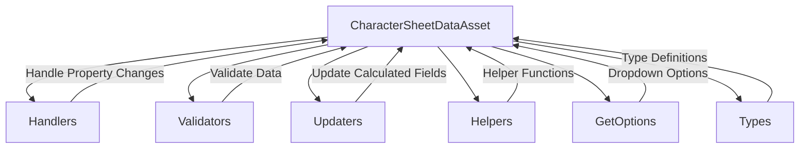

# Estrutura de Arquivos Recomendada

---

## 📝 Changelog

| Versão | Data | Alteração |
|--------|------|-----------|
| v1.0 | 2024-12-27 | Extraído de architecture.md |

---

## 📁 Organização de Diretórios e Arquivos

```mermaid
graph TD
Root[Source/MyProject2/] --> Chars[Characters/]
Root --> CreateSheet[CreateSheet/]
Root --> Comp[Components/]
Root --> Data[Data/]
Root --> Gameplay[Gameplay/]
Root --> Utils[Utils/]

Chars --> CharsData[Data/<br/>CharacterSheetDataAsset]
Chars --> CharsComp[Components/<br/>CharacterSheetComponent<br/>CharacterDataComponent]

CreateSheet --> CreateSheetCore[Core/<br/>CharacterSheetCore<br/>CharacterSheetData]
CreateSheet --> CreateSheetRace[RaceBonus/<br/>RaceBonusMotor<br/>RaceBonusHelpers]
CreateSheet --> CreateSheetPointBuy[PointBuy/<br/>PointBuyMotor<br/>PointBuyValidator]
CreateSheet --> CreateSheetMulticlass[Multiclass/<br/>MulticlassMotor<br/>MulticlassHelpers]
CreateSheet --> CreateSheetChoices[Choices/<br/>🔮 Planejado]

Comp --> CompFeat[Features/<br/>🔮 Planejado<br/>SpellcastingComponent<br/>SecondWindComponent]
Comp --> CompData[Data/]

Data --> DataTab[Tables/<br/>RaceDataTable<br/>ClassDataTable]
Data --> DataAssets[Assets/]

Gameplay --> GameplayAbil[Abilities/]
Gameplay --> GameplaySys[Systems/]

Utils --> UtilsCalc[CalculationHelpers]
Utils --> UtilsChar[CharacterSheetHelpers]
Utils --> UtilsData[DataTableHelpers]
Utils --> UtilsVal[ValidationHelpers]
Utils --> UtilsFmt[FormattingHelpers]
Utils --> UtilsComp[ComponentHelpers]

style Root fill:#2196f3,color:#fff
style Chars fill:#4caf50,color:#fff
style CreateSheet fill:#ffc107,color:#000
style Comp fill:#ff9800,color:#fff
style Data fill:#9c27b0,color:#fff
style Gameplay fill:#f44336,color:#fff
style Utils fill:#00bcd4,color:#fff
```



---

## Estrutura Detalhada

```
Source/MyProject2/
├── Characters/
│   ├── Data/
│   │   ├── CharacterSheetDataAsset.h
│   │   ├── CharacterSheetDataAsset.cpp
│   │   ├── Handlers/
│   │   ├── Validators/
│   │   ├── Updaters/
│   │   ├── Helpers/
│   │   └── GetOptions/
│   └── Components/
│       ├── CharacterSheetComponent.h
│       ├── CharacterSheetComponent.cpp
│       ├── CharacterDataComponent.h
│       └── CharacterDataComponent.cpp
├── CreateSheet/
│   ├── Core/
│   ├── RaceBonus/
│   ├── PointBuy/
│   ├── Multiclass/
│   └── (Choices/ - 🔮 Planejado)
├── Components/
│   ├── (Features/ - 🔮 Planejado)
│   └── Data/
├── Logging/
│   ├── LoggingSystem.h
│   └── LoggingSystem.cpp
├── Data/
│   ├── Tables/
│   └── Assets/
├── Gameplay/
│   ├── Abilities/
│   └── Systems/
└── Utils/
    ├── CalculationHelpers.h
    ├── CalculationHelpers.cpp
    ├── CharacterSheetHelpers.h
    ├── CharacterSheetHelpers.cpp
    ├── DataTableHelpers.h
    ├── DataTableHelpers.cpp
    ├── ValidationHelpers.h
    ├── ValidationHelpers.cpp
    ├── FormattingHelpers.h
    ├── FormattingHelpers.cpp
    ├── ComponentHelpers.h
    └── ComponentHelpers.cpp
```

---

## Organização Modular do CharacterSheetDataAsset

O `CharacterSheetDataAsset` utiliza uma arquitetura modular baseada em responsabilidades separadas, seguindo princípios de Clean Code e Design Patterns.

**Estrutura Modular:**



**Módulos e Responsabilidades:**

- **Handlers:** Processar mudanças de propriedades no editor
- **Validators:** Validar integridade e consistência dos dados
- **Updaters:** Atualizar campos calculados baseados em dados do personagem
- **Helpers:** Funções auxiliares reutilizáveis
- **GetOptions:** Lógica para popular dropdowns no editor
- **Types:** Definições de tipos compartilhados

**Vantagens da Organização Modular:**

- ✅ **Manutenibilidade:** Cada módulo tem responsabilidade única e clara
- ✅ **Testabilidade:** Funções estáticas podem ser testadas isoladamente
- ✅ **Extensibilidade:** Fácil adicionar novos handlers, validators ou updaters
- ✅ **Clean Code:** Funções pequenas (< 50 linhas), focadas, reutilizáveis
- ✅ **Performance:** Lookup table com ponteiros de função estáticos (sem overhead de std::function)

---

**Navegação:** [← Checklist](checklist.md) | [→ Sistema de Logging](logging.md)

**Última atualização:** 2024-12-27
