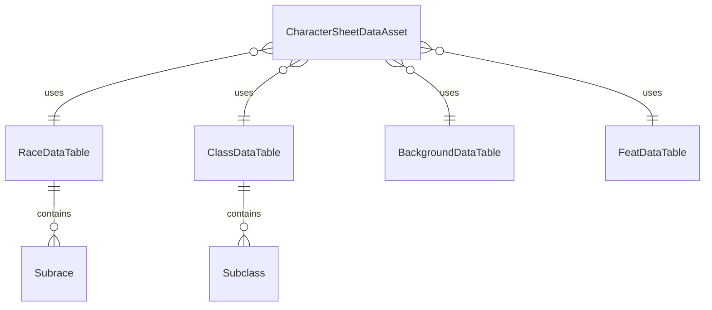

# Data Tables - Visão Geral

---

## 📝 Changelog

| Versão | Data | Alteração |
|--------|------|-----------|
| v1.0 | 2024-12-27 | Extraído de data-tables.md |

---

## 📊 Visão Geral

Os Data Tables armazenam dados estruturados de D&D 5e (raças, classes, backgrounds, feats) em formato JSON, permitindo que designers modifiquem regras sem alterar código.

**Filosofia de Estrutura:**

- **Estrutura "Flat" (Plana)**: JSONs relacionais e planos, não profundamente aninhados (o importador do Unreal quebra com estruturas muito aninhadas)
- **Padrão "ID + Tags + Payload"**: Cada entrada tem um ID único, tags para categorização, e payload com dados específicos
- **Separação Static/Dynamic**: Data Tables contêm apenas definições estáticas (o que o item "é"), não estado dinâmico (o que o item "tem" agora)
- **Composição sobre Herança**: Use referências por ID ao invés de estruturas aninhadas complexas

**📖 Para mais detalhes sobre arquitetura de dados, veja:**

- [Estrutura de Dados Ideal](../../Estudos/ideal-data-structure-report.md)
- [Arquiteturas de Alta Performance](../../Estudos/high-performance-architectures-report.md)

---

## 🔗 Estrutura de Relacionamento

---

**Navegação:** [← Índice](index.md) | [→ Estrutura Comum](estrutura-comum.md)

**Última atualização:** 2024-12-27
