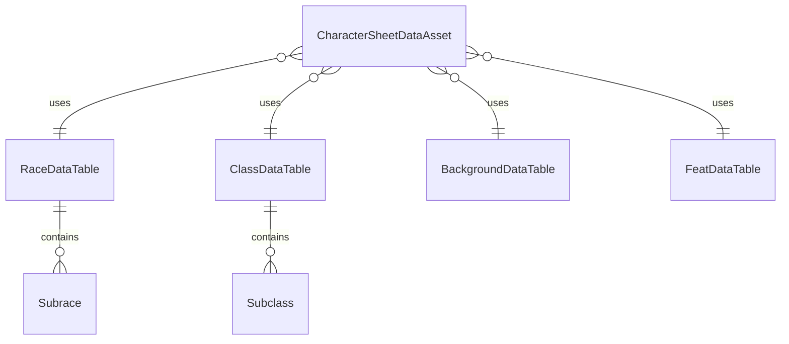

# Documentação de Data Tables

Guia completo sobre a estrutura, criação e uso dos Data Tables no sistema de fichas D&D 5e.

## Visão Geral

Os Data Tables armazenam dados estruturados de D&D 5e (raças, classes, backgrounds, feats) em formato JSON, permitindo que designers modifiquem regras sem alterar código.

## Estrutura de Relacionamento



## RaceDataTable

**Caminho:** `Source/MyProject2/Data/Tables/RaceDataTable.h`

**Struct:** `FRaceDataRow`

### Campos

| Campo | Tipo | Descrição |
|-------|------|-----------|
| `RaceName` | `FName` | Nome da raça (ex: "Human", "Elf", "Dwarf") |
| `Description` | `FText` | Descrição textual da raça (localizável) |
| `AbilityScoreImprovements` | `TArray<FAbilityScoreImprovement>` | Bônus de atributos da raça |
| `Size` | `FName` | Tamanho da raça (ex: "Small", "Medium") |
| `BaseSpeed` | `int32` | Velocidade base em pés |
| `Traits` | `TArray<FRaceTrait>` | Traits da raça (Darkvision, etc.) |
| `SubraceNames` | `TArray<FName>` | Lista de sub-raças disponíveis |

### FAbilityScoreImprovement

```cpp
USTRUCT(BlueprintType)
struct FAbilityScoreImprovement
{
    FName AbilityName;  // Nome do atributo (ex: "Strength", "Constitution")
    int32 Bonus;        // Valor do bônus (geralmente +1 ou +2)
};
```

**Nota Especial:** Para Variant Human, use `AbilityName = "Custom"` com `Bonus = 1`. O sistema aplicará +1 para cada atributo escolhido em `CustomAbilityScoreChoices`.

### FRaceTrait

```cpp
USTRUCT(BlueprintType)
struct FRaceTrait
{
    FName TraitName;                    // Nome do trait (ex: "Darkvision")
    FText Description;                  // Descrição textual
    TMap<FName, FString> TraitData;     // Dados estruturados opcionais
};
```

### Exemplo de JSON

```json
{
  "Name": "Human",
  "RaceName": "Human",
  "Description": "Humans are the most adaptable and ambitious people among the common races.",
  "AbilityScoreImprovements": [
    {
      "AbilityName": "Strength",
      "Bonus": 1
    },
    {
      "AbilityName": "Dexterity",
      "Bonus": 1
    },
    {
      "AbilityName": "Constitution",
      "Bonus": 1
    },
    {
      "AbilityName": "Intelligence",
      "Bonus": 1
    },
    {
      "AbilityName": "Wisdom",
      "Bonus": 1
    },
    {
      "AbilityName": "Charisma",
      "Bonus": 1
    }
  ],
  "Size": "Medium",
  "BaseSpeed": 30,
  "Traits": [],
  "SubraceNames": ["Standard Human", "Variant Human"]
}
```

### Exemplo: Variant Human (Sub-raça)

```json
{
  "Name": "Variant Human",
  "RaceName": "Variant Human",
  "Description": "Some humans are more versatile than others.",
  "AbilityScoreImprovements": [
    {
      "AbilityName": "Custom",
      "Bonus": 1
    }
  ],
  "Size": "Medium",
  "BaseSpeed": 30,
  "Traits": [
    {
      "TraitName": "FeatChoice",
      "Description": "You gain one feat of your choice.",
      "TraitData": {}
    },
    {
      "TraitName": "SkillChoice",
      "Description": "You gain proficiency in one skill of your choice.",
      "TraitData": {}
    }
  ],
  "SubraceNames": []
}
```

**Importante:**
- `AbilityName = "Custom"` indica que o jogador escolhe 2 atributos para receber +1 cada
- Traits `FeatChoice` e `SkillChoice` indicam escolhas do jogador

## ClassDataTable

**Caminho:** `Source/MyProject2/Data/Tables/ClassDataTable.h`

**Struct:** `FClassDataRow`

### Campos

| Campo | Tipo | Descrição |
|-------|------|-----------|
| `ClassName` | `FName` | Nome da classe (ex: "Fighter", "Wizard", "Rogue") |
| `Description` | `FText` | Descrição textual da classe |
| `HitDie` | `int32` | Tipo de dado de vida (ex: 8 para d8, 10 para d10) |
| `Proficiencies` | `TArray<FClassProficiency>` | Proficiências da classe |
| `Features` | `TArray<FClassFeature>` | Features da classe por nível |
| `SubclassNames` | `TArray<FName>` | Lista de subclasses disponíveis |

### FClassProficiency

```cpp
USTRUCT(BlueprintType)
struct FClassProficiency
{
    FName ProficiencyType;  // Tipo: "Weapon", "Armor", "SavingThrow", "Skill"
    FName ProficiencyName; // Nome específico (ex: "Longsword", "Light Armor", "Strength", "Athletics")
};
```

### FClassFeature

```cpp
USTRUCT(BlueprintType)
struct FClassFeature
{
    FName FeatureName;                    // Nome da feature (ex: "Second Wind", "Action Surge")
    FText Description;                    // Descrição textual
    int32 LevelUnlocked;                  // Nível em que é desbloqueada
    FName FeatureType;                    // Tipo: "Automatic", "SubclassSelection", "ASI", "Choice"
    TMap<FName, FString> FeatureData;     // Dados estruturados opcionais
};
```

### Exemplo de JSON

```json
{
  "Name": "Fighter",
  "ClassName": "Fighter",
  "Description": "A master of martial combat, skilled with a variety of weapons and armor.",
  "HitDie": 10,
  "Proficiencies": [
    {
      "ProficiencyType": "Armor",
      "ProficiencyName": "All Armor"
    },
    {
      "ProficiencyType": "Weapon",
      "ProficiencyName": "Simple Weapons"
    },
    {
      "ProficiencyType": "Weapon",
      "ProficiencyName": "Martial Weapons"
    },
    {
      "ProficiencyType": "SavingThrow",
      "ProficiencyName": "Strength"
    },
    {
      "ProficiencyType": "SavingThrow",
      "ProficiencyName": "Constitution"
    }
  ],
  "Features": [
    {
      "FeatureName": "Second Wind",
      "Description": "You have a limited well of stamina that you can draw on to protect yourself from harm.",
      "LevelUnlocked": 1,
      "FeatureType": "Automatic",
      "FeatureData": {
        "UsesPerRest": "1",
        "Type": "BonusAction"
      }
    },
    {
      "FeatureName": "Action Surge",
      "Description": "You can push yourself beyond your normal limits for a moment.",
      "LevelUnlocked": 2,
      "FeatureType": "Automatic",
      "FeatureData": {
        "UsesPerRest": "1"
      }
    },
    {
      "FeatureName": "Martial Archetype",
      "Description": "You choose an archetype that you strive to emulate.",
      "LevelUnlocked": 3,
      "FeatureType": "SubclassSelection",
      "FeatureData": {}
    }
  ],
  "SubclassNames": ["Champion", "Battle Master", "Eldritch Knight"]
}
```

## BackgroundDataTable

**Caminho:** `Source/MyProject2/Data/Tables/BackgroundDataTable.h`

**Struct:** `FBackgroundDataRow`

### Campos

| Campo | Tipo | Descrição |
|-------|------|-----------|
| `BackgroundName` | `FName` | Nome do background (ex: "Acolyte", "Criminal", "Noble") |
| `Description` | `FText` | Descrição textual do background |
| `SkillProficiencies` | `TArray<FName>` | Skills em que o background fornece proficiência |
| `LanguageProficiencies` | `TArray<FName>` | Idiomas em que o background fornece proficiência |
| `Equipment` | `TArray<FName>` | Equipamento inicial (FNames de itens) |
| `FeatureName` | `FName` | Nome da feature especial do background |
| `FeatureDescription` | `FText` | Descrição da feature |

### Exemplo de JSON

```json
{
  "Name": "Acolyte",
  "BackgroundName": "Acolyte",
  "Description": "You have spent your life in the service of a temple.",
  "SkillProficiencies": ["Insight", "Religion"],
  "LanguageProficiencies": ["Common", "One additional language"],
  "Equipment": ["Holy Symbol", "Prayer Book", "Common Clothes", "15 Gold"],
  "FeatureName": "Shelter of the Faithful",
  "FeatureDescription": "You and your adventuring companions can receive free healing and care at a temple."
}
```

## FeatDataTable

**Caminho:** `Source/MyProject2/Data/Tables/FeatDataTable.h`

**Struct:** `FFeatDataRow`

### Campos

| Campo | Tipo | Descrição |
|-------|------|-----------|
| `FeatName` | `FName` | Nome do feat (ex: "Alert", "Magic Initiate", "War Caster") |
| `Description` | `FText` | Descrição textual do feat |
| `Prerequisites` | `TArray<FName>` | Pré-requisitos para adquirir o feat |
| `Benefits` | `TMap<FName, FString>` | Benefícios estruturados (dados programáticos) |

### Exemplo de JSON

```json
{
  "Name": "Alert",
  "FeatName": "Alert",
  "Description": "Always on the lookout for danger, you gain the following benefits.",
  "Prerequisites": [],
  "Benefits": {
    "InitiativeBonus": "5",
    "CannotBeSurprised": "true"
  }
}
```

**Exemplo com pré-requisitos:**

```json
{
  "Name": "War Caster",
  "FeatName": "War Caster",
  "Description": "You have practiced casting spells in the midst of combat.",
  "Prerequisites": ["Ability to cast at least one spell"],
  "Benefits": {
    "AdvantageOnConcentration": "true",
    "CanCastSpellAsOpportunityAttack": "true"
  }
}
```

## Como Criar/Editar Data Tables no Editor

### 1. Criar Data Table

1. No Content Browser, navegue até a pasta desejada
2. Clique com botão direito → **Miscellaneous** → **Data Table**
3. Selecione o struct apropriado:
   - `Race Data Row` para raças
   - `Class Data Row` para classes
   - `Background Data Row` para backgrounds
   - `Feat Data Row` para feats
4. Nomeie o Data Table (ex: `DT_Races`, `DT_Classes`)

### 2. Importar JSON

1. Selecione o Data Table criado
2. No Details Panel, clique em **Import**
3. Selecione o arquivo JSON
4. O sistema importará automaticamente os dados

**Formato JSON esperado:**
- Array de objetos
- Cada objeto representa uma linha
- Campo `Name` é usado como Row Name no Data Table

### 3. Editar Manualmente

1. Selecione o Data Table
2. No Details Panel, clique em **Add Row** para adicionar nova entrada
3. Preencha os campos conforme necessário
4. Use **Remove Row** para remover entradas

## Validações Aplicadas

### RaceDataTable

- **Sub-raças:** Sistema valida que sub-raça pertence à raça selecionada
- **Custom ASI:** Variant Human com `AbilityName = "Custom"` é tratado especialmente
- **Traits:** Traits `FeatChoice` e `SkillChoice` habilitam escolhas do jogador

### ClassDataTable

- **Features por nível:** Sistema coleta features baseado no nível do personagem
- **Subclasses:** Sistema valida que subclasse pertence à classe selecionada
- **Proficiências:** Sistema agrega proficiências de todas as classes do personagem

### BackgroundDataTable

- **Proficiências:** Sistema agrega skill proficiencies ao personagem
- **Features:** Features de background são adicionadas automaticamente

### FeatDataTable

- **Pré-requisitos:** Sistema valida pré-requisitos antes de permitir seleção
- **Disponibilidade:** Apenas feats sem pré-requisitos de nível aparecem no nível 1

## Exemplos de JSON Válido

### Raça Completa (Dwarf)

```json
{
  "Name": "Dwarf",
  "RaceName": "Dwarf",
  "Description": "Bold and hardy dwarves are known as skilled warriors miners and workers of stone and metal",
  "AbilityScoreImprovements": [
    {
      "AbilityName": "Constitution",
      "Bonus": 2
    }
  ],
  "Size": "Medium",
  "BaseSpeed": 25,
  "Traits": [
    {
      "TraitName": "Darkvision",
      "Description": "Accustomed to life underground, you have superior vision in dark and dim conditions.",
      "TraitData": {
        "Range": "60",
        "Type": "Vision"
      }
    },
    {
      "TraitName": "Dwarven Resilience",
      "Description": "You have advantage on saving throws against poison.",
      "TraitData": {
        "Advantage": "Poison",
        "Resistance": "Poison"
      }
    }
  ],
  "SubraceNames": ["Hill Dwarf", "Mountain Dwarf"]
}
```

### Classe Completa (Wizard)

```json
{
  "Name": "Wizard",
  "ClassName": "Wizard",
  "Description": "A scholarly magic-user capable of manipulating the structures of reality.",
  "HitDie": 6,
  "Proficiencies": [
    {
      "ProficiencyType": "Weapon",
      "ProficiencyName": "Daggers"
    },
    {
      "ProficiencyType": "Weapon",
      "ProficiencyName": "Darts"
    },
    {
      "ProficiencyType": "SavingThrow",
      "ProficiencyName": "Intelligence"
    },
    {
      "ProficiencyType": "SavingThrow",
      "ProficiencyName": "Wisdom"
    }
  ],
  "Features": [
    {
      "FeatureName": "Spellcasting",
      "Description": "As a student of arcane magic, you have a spellbook containing spells.",
      "LevelUnlocked": 1,
      "FeatureType": "Automatic",
      "FeatureData": {
        "SpellcastingAbility": "Intelligence",
        "SpellSaveDC": "8 + Proficiency + Intelligence Modifier"
      }
    },
    {
      "FeatureName": "Arcane Tradition",
      "Description": "You choose an arcane tradition.",
      "LevelUnlocked": 2,
      "FeatureType": "SubclassSelection",
      "FeatureData": {}
    }
  ],
  "SubclassNames": ["Evocation", "Abjuration", "Necromancy"]
}
```

## Boas Práticas

1. **Nomes consistentes:** Use nomes consistentes entre Data Tables (ex: "Human" em RaceDataTable deve corresponder a "Human" em CharacterSheetDataAsset)
2. **Row Names:** Use o campo `Name` como Row Name (facilita busca com `FindRow`)
3. **Localização:** Use `FText` para descrições (suporta localização)
4. **Dados estruturados:** Use `TMap<FName, FString>` para dados programáticos quando necessário
5. **Validação:** Sempre valide JSON antes de importar (use validação JSON online)

## Troubleshooting

### Problema: Sub-raça não aparece no dropdown

**Solução:** Verifique se `SubraceNames` na raça base contém o nome da sub-raça, e se a sub-raça existe no Data Table.

### Problema: Feat não aparece para Variant Human

**Solução:** Verifique se o feat não tem pré-requisitos de nível ou ability score que o personagem não atende.

### Problema: Bônus raciais não aplicando

**Solução:** Verifique se `AbilityName` corresponde exatamente aos nomes dos atributos ("Strength", "Dexterity", etc.) ou "Custom" para Variant Human.
