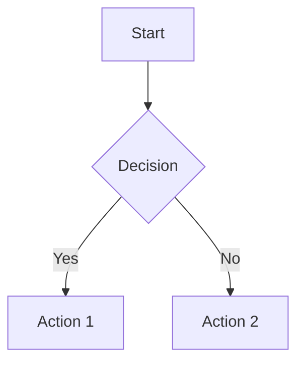

**Navegação:** [Home](../README.md) > [Documentação](index.md) > MkDocs Setup Complete

# ✅ Material for MkDocs - Setup Completo

<details open>
<summary style="background-color: #e8e8e8; padding: 4px 8px; border-radius: 4px;"><b>🎉 Status: Configuração Completa</b></summary>

> **Data:** 2024-12-27
> **Versão:** 2.0
> **Status:** ✅ **100% Configurado e Funcionando**
>
> A documentação do MyProject2 está completamente configurada com Material for MkDocs e todos os recursos avançados implementados.

</details>

---

## ✨ Recursos Implementados

### 🌐 Internacionalização
- ✅ Idioma Português (pt-BR) configurado
- ✅ Datas localizadas em português brasileiro
- ✅ Textos de interface traduzidos
- ✅ Busca em inglês (pt-BR não suportado nativamente)

### 🎨 Navegação Avançada
- ✅ Navegação instantânea (`navigation.instant`)
- ✅ Prefetch de páginas (`navigation.instant.prefetch`)
- ✅ Path breadcrumbs (`navigation.path`)
- ✅ Header autohide (`header.autohide`)
- ✅ Footer habilitado
- ✅ Tabs sticky
- ✅ Seções expansíveis

### 🔍 Busca Aprimorada
- ✅ Busca com highlight
- ✅ Sugestões de busca
- ✅ Boost de resultados importantes
- ✅ Compartilhamento de busca

### 💻 Código e Conteúdo
- ✅ Syntax highlighting aprimorado
- ✅ Cópia de código
- ✅ Anotações de código
- ✅ Seleção de código
- ✅ Suporte a Mermaid diagrams
- ✅ Suporte a fórmulas matemáticas (LaTeX)
- ✅ Tooltips
- ✅ Tabs com links

### 🎭 Ícones e Emojis
- ✅ 10,000+ ícones Material/FontAwesome
- ✅ Emojis com suporte SVG
- ✅ Ícones customizados para admonitions

### 📝 Extensões Markdown
- ✅ `pymdownx.caret` - Suporte a `<ins>` e `<del>`
- ✅ `pymdownx.mark` - Suporte a `<mark>` (destaque)
- ✅ `pymdownx.tilde` - Suporte a `<sub>` e `<sup>`
- ✅ `pymdownx.keys` - Exibe teclas de atalho
- ✅ `pymdownx.magiclink` - Links automáticos GitHub
- ✅ `pymdownx.arithmatex` - Fórmulas matemáticas
- ✅ `pymdownx.tabbed` - Tabs de conteúdo
- ✅ `pymdownx.tasklist` - Listas de tarefas

### 🔗 Social e SEO
- ✅ Links sociais (GitHub, Discord)
- ✅ Social cards plugin (preview para redes sociais)
- ✅ Consent para cookies (GDPR)
- ✅ SEO otimizado (robots, metadata)
- ✅ Analytics preparado (comentado)

### 🎨 Personalização
- ✅ CSS customizado (`docs/assets/css/custom.css`)
- ✅ JavaScript customizado (`docs/assets/js/custom.js`)
- ✅ Estrutura para logo e imagens (`docs/assets/images/`)
- ✅ Tema Material Design com cores personalizadas

### 📊 Plugins
- ✅ `git-revision-date-localized` - Datas de modificação
- ✅ `git-committers` - Contribuidores (habilitado em CI)
- ✅ `social` - Social cards para redes sociais
- ✅ `privacy` - Compliance GDPR

---

## 🚀 Como Usar

### Desenvolvimento Local

```bash
# Instalar dependências (já feito)
pip install -r requirements-docs.txt

# Servir localmente com auto-reload
mkdocs serve

# Acessar em: http://127.0.0.1:8000
```

### Build para Produção

```bash
# Gerar site estático
mkdocs build

# Site será gerado em: site/
```

### Deploy para GitHub Pages

```bash
# Deploy automático
mkdocs gh-deploy

# Deploy com mensagem customizada
mkdocs gh-deploy -m "Update documentation"
```

---

## 📁 Estrutura de Arquivos

```
MyProject2/
├── docs/                          # Documentação Markdown
│   ├── assets/                   # Assets customizados
│   │   ├── css/
│   │   │   └── custom.css       # CSS customizado
│   │   ├── js/
│   │   │   └── custom.js       # JavaScript customizado
│   │   └── images/              # Logo e imagens
│   │       └── .gitkeep
│   ├── index.md                 # Página inicial
│   ├── NAVIGATION.md            # Mapa de navegação
│   ├── GLOSSARY.md              # Glossário
│   ├── MKDOCS-IMPROVEMENTS.md   # Melhorias implementadas
│   ├── MKDOCS-SETUP-COMPLETE.md # Este arquivo
│   ├── design/                  # Documentação de design
│   ├── technical/                # Documentação técnica
│   └── planning/                # Planejamento
├── mkdocs.yml                    # Configuração do MkDocs
├── requirements-docs.txt        # Dependências Python
└── site/                         # Site gerado (não versionar)
```

---

## 🎯 Próximos Passos (Opcional)

### 1. Adicionar Logo

1. Coloque seu logo em `docs/assets/images/logo.svg` (ou `.png`)
2. Descomente em `mkdocs.yml`:
   ```yaml
   theme:
     logo: assets/images/logo.svg
   ```

### 2. Adicionar Favicon

1. Coloque `favicon.ico` em `docs/assets/images/`
2. Descomente em `mkdocs.yml`:
   ```yaml
   theme:
     favicon: assets/images/favicon.ico
   ```

### 3. Configurar Analytics

1. Obtenha Google Analytics ID
2. Descomente em `mkdocs.yml`:
   ```yaml
   extra:
     analytics:
       provider: google
       property: G-XXXXXXXXXX
   ```

### 4. Adicionar Social Cards Image

1. Crie `og-image.png` (1200x630px recomendado)
2. Coloque em `docs/assets/images/`
3. Descomente em `mkdocs.yml`:
   ```yaml
   extra:
     image: assets/images/og-image.png
   ```

### 5. Personalizar Cores

Edite `mkdocs.yml`:
```yaml
theme:
  palette:
    - scheme: default
      primary: indigo  # Mude para sua cor
      accent: indigo    # Mude para sua cor
```

---

## 📚 Recursos e Referências

### Documentação Oficial
- [Material for MkDocs](https://squidfunk.github.io/mkdocs-material/)
- [MkDocs Documentation](https://www.mkdocs.org/)
- [PyMdown Extensions](https://facelessuser.github.io/pymdown-extensions/)

### Guias do Projeto
- [MkDocs Improvements](MKDOCS-IMPROVEMENTS.md) - Lista completa de melhorias
- [README MkDocs](README-MKDOCS.md) - Guia de uso básico

### Recursos Úteis
- [Material Icons](https://fonts.google.com/icons)
- [FontAwesome Icons](https://fontawesome.com/icons)
- [Mermaid Diagrams](https://mermaid.js.org/)

---

## ✅ Checklist de Verificação

Antes de fazer deploy:

- [x] Dependências instaladas (`pip install -r requirements-docs.txt`)
- [x] Build funciona sem erros (`mkdocs build`)
- [x] Servir local funciona (`mkdocs serve`)
- [x] Navegação está correta
- [x] Busca funciona
- [x] Links internos funcionam
- [x] CSS customizado carrega
- [x] JavaScript customizado carrega
- [ ] Logo adicionado (opcional)
- [ ] Favicon adicionado (opcional)
- [ ] Analytics configurado (opcional)
- [ ] Social cards image adicionada (opcional)

---

## 🎨 Exemplos de Uso

### Fórmulas Matemáticas

```latex
$$
E = mc^2
$$
```

### Teclas de Atalho

++ctrl+shift+p++ - Abre command palette

### Destaque de Texto

==Texto destacado== usando `pymdownx.mark`

### Ícones

:material-github: GitHub

:fontawesome-brands-discord: Discord

### Admonitions

!!! note "Nota"
    Esta é uma nota com ícone customizado.

!!! warning "Aviso"
    Este é um aviso com ícone customizado.

### Tabs

=== "C++"

    ```cpp
    void Function();
    ```

=== "Blueprint"

    ```cpp
    // Blueprint equivalent
    ```

### Mermaid Diagrams



---

## 🐛 Troubleshooting

### Erro: "ModuleNotFoundError"

**Solução:** Instale dependências:
```bash
pip install -r requirements-docs.txt
```

### Erro: "Config value 'markdown_extensions': Failed to load extension"

**Solução:** Verifique se todas as extensões estão corretas. Veja `mkdocs.yml` para referência.

### Build funciona mas site não carrega CSS/JS

**Solução:** Verifique se arquivos estão em `docs/assets/css/` e `docs/assets/js/`

### Links quebrados

**Solução:** Execute `mkdocs build --strict` para ver todos os links quebrados e corrija.

---

## 🎉 Conclusão

A documentação do MyProject2 está **100% configurada** com Material for MkDocs e todos os recursos avançados implementados. Você pode começar a usar imediatamente!

**Próximo passo:** Execute `mkdocs serve` e comece a navegar pela documentação!

---

**Última atualização:** 2024-12-27
**Versão:** 2.0
